# MODUL 3

## 1. Interaksi Dasar HTTP GET/Response
Pada praktikum week 2 ini masih melanjutkan pembahasan pada modul 3 mengenai HTTP. Namun, pada bagian ini lebih difokuskan pada pemahaman tentang interaksi dasar antara HTTP GET dan response yang terjadi antara client dan server.

## Langkah-langkah Percobaan
1. Pertama, jalankan aplikasi Wireshark terlebih dahulu.
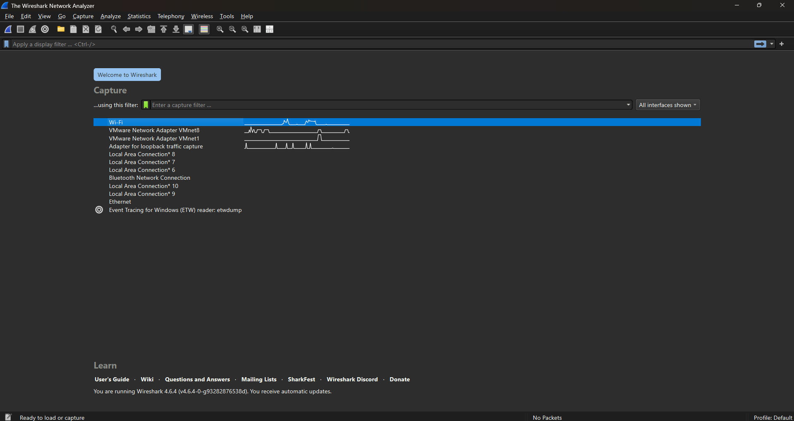

2. Setelah aplikasi terbuka, pilih jaringan WIFI untuk memulai proses capture paket.
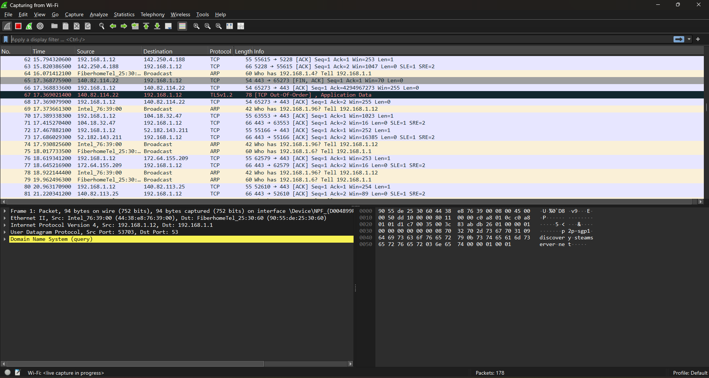

3. Pastikan proses capture sudah berjalan, kemudian buka browser dan akses halaman berikut: http://gaia.cs.umass.edu/wireshark-labs/HTTP-wireshark-file1.html
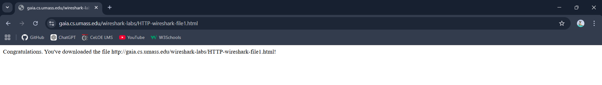

4. Gunakan fitur filter pada Wireshark untuk menampilkan paket dengan protokol HTTP.
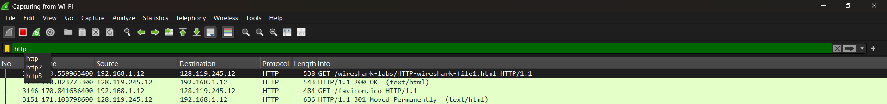

5. Hentikan proses capture, lalu pilih salah satu paket untuk melihat detail informasi yang ditampilkan.
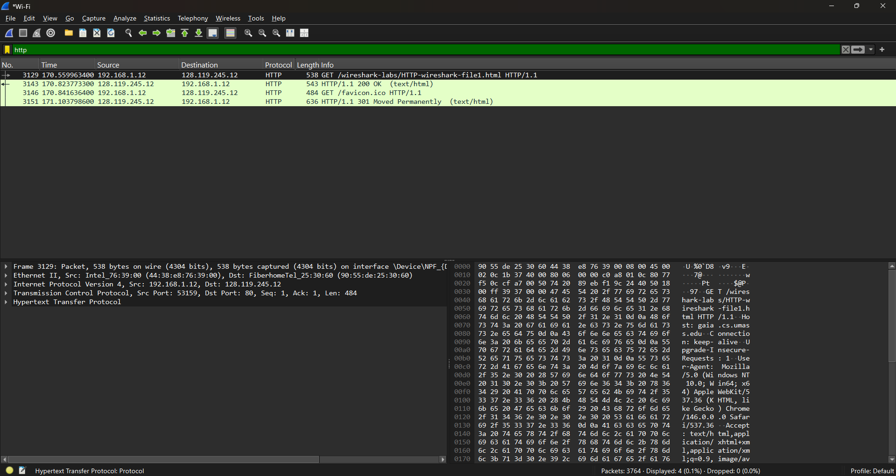

---

## Uji Coba Web Tidak Ditemukan (Web Not Found)
Percobaan ini dilakukan untuk melihat bagaimana respon server ketika mengakses alamat website yang tidak valid namun tetap menggunakan protokol HTTP.

## Langkah-langkah Percobaan
1. Buka Wireshark, pilih jaringan WIFI, lalu mulai proses capture paket.

2. Terapkan filter HTTP untuk menampilkan paket yang relevan.

3. Selanjutnya, coba akses link HTTP yang dimodifikasi dengan menambahkan karakter acak, misalnya:
http://gaia.cs.umass.edu/wireshark-labsrfiioef/HTTP-wireshark-file1.html

4. Setelah itu, periksa kembali di Wireshark dan akan terlihat status error seperti kode 404 pada paket HTTP.
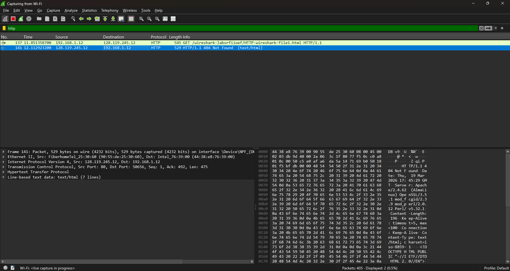

---

## 2. Mengambil Dokumen Berukuran Besar (Retrieving Long Documents)
Pada bagian ini membahas proses pengambilan data berukuran besar, seperti halaman web atau file, melalui jaringan. Proses ini dapat diamati melalui hasil capture paket menggunakan protokol seperti HTTP, TCP, maupun FTP.

## Langkah-langkah Percobaan
1. Jalankan Wireshark dan pilih jaringan WIFI, kemudian mulai capture paket.

2. Buka browser dan akses halaman berikut:
http://gaia.cs.umass.edu/wireshark-labs/HTTP-wireshark-file3.html
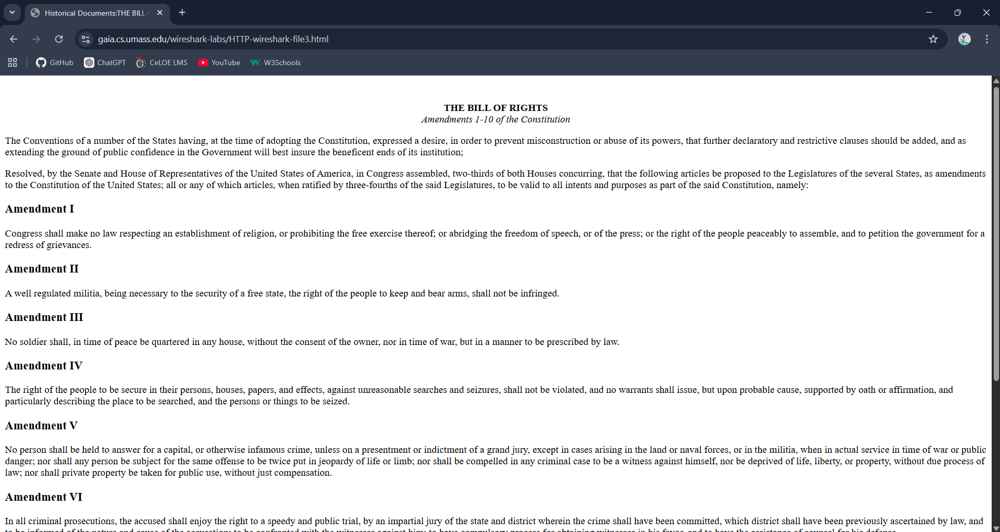

3. Gunakan filter HTTP untuk menampilkan paket yang sesuai. Kemudian pilih salah satu paket untuk melihat detail isi paket tersebut.
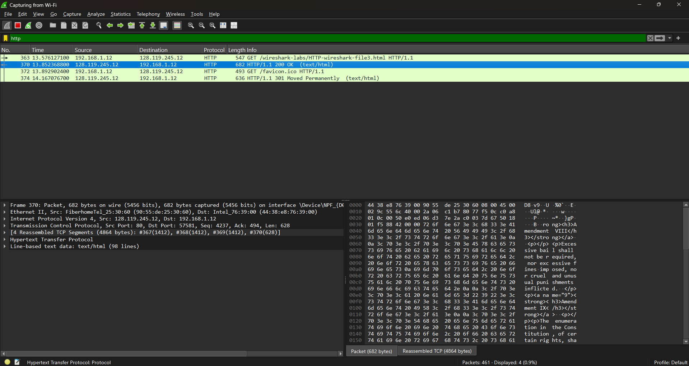

---

## 3. Dokumen HTML dengan Embedded Objects
Pada modul ini mempelajari dokumen HTML yang memiliki objek tambahan seperti gambar, CSS, atau JavaScript. Ketika halaman dibuka, browser akan mengirim beberapa request HTTP untuk mengambil semua elemen tersebut, yang dapat diamati melalui Wireshark.

## Langkah-langkah Percobaan
1. Buka Wireshark, pilih jaringan WIFI, lalu mulai capture paket.
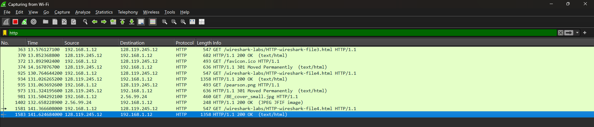

2. Buka browser dan akses halaman berikut:
http://gaia.cs.umass.edu/wireshark-labs/HTTP-wireshark-file4.html
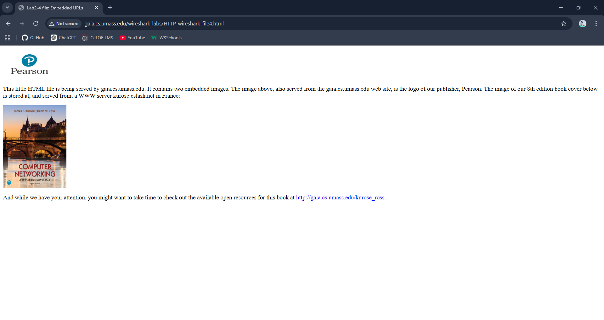

3. Kembali ke Wireshark dan gunakan filter HTTP untuk melihat paket yang ditangkap. Setelah halaman dibuka, pada Wireshark akan terlihat data seperti format JPEG, karena halaman tersebut memuat gambar yang ikut dikirim melalui request HTTP.
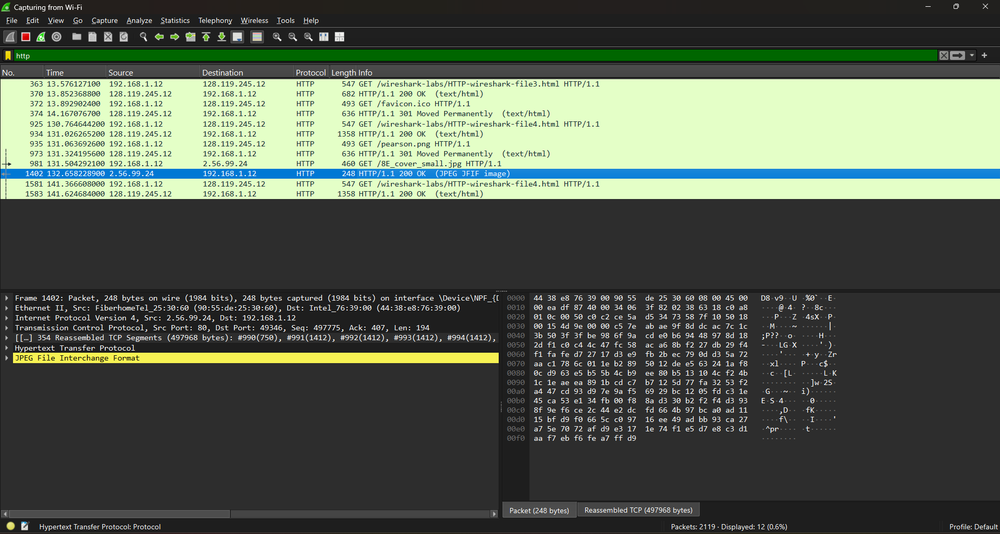

---

## 4. HTTP Authentication
Pada bagian ini membahas proses autentikasi HTTP, yaitu mekanisme login ketika client mengakses halaman yang memerlukan username dan password. Proses ini dapat diamati melalui paket HTTP yang ditangkap oleh Wireshark.

## Langkah-langkah Percobaan
1. Jalankan Wireshark, pilih jaringan WIFI, lalu mulai capture paket.

2. Buka browser dan akses halaman berikut:
http://gaia.cs.umass.edu/wireshark-labs/protected_pages/HTTP-wireshark-file5.html
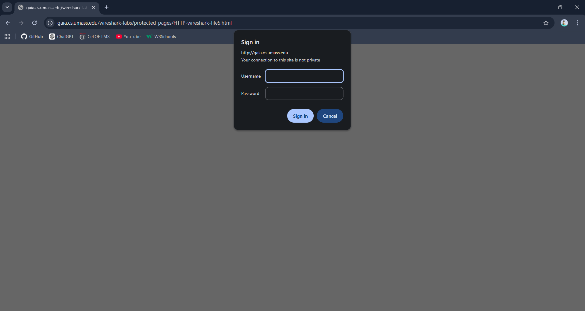

3. Masukkan username **wireshark-students** dan password **network**, lalu tekan enter.
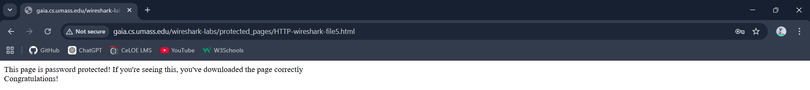

4. Setelah berhasil, pada Wireshark akan terlihat respon seperti "Unauthorized" pada salah satu paket HTTP.
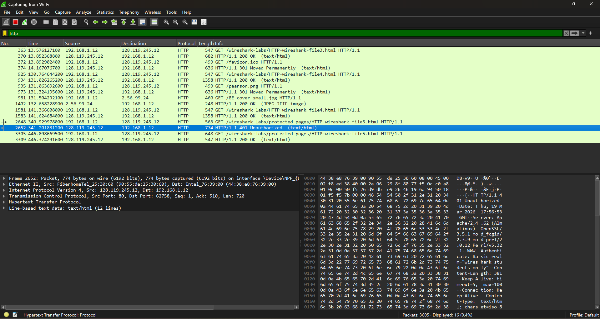