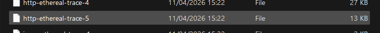
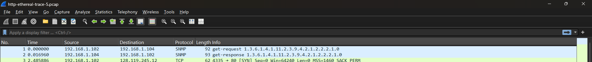
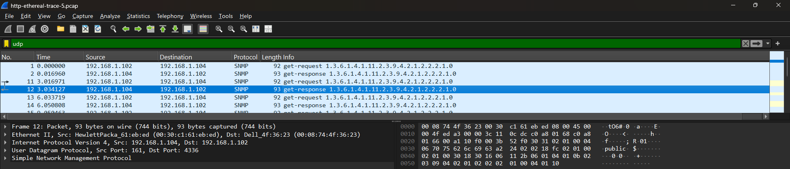
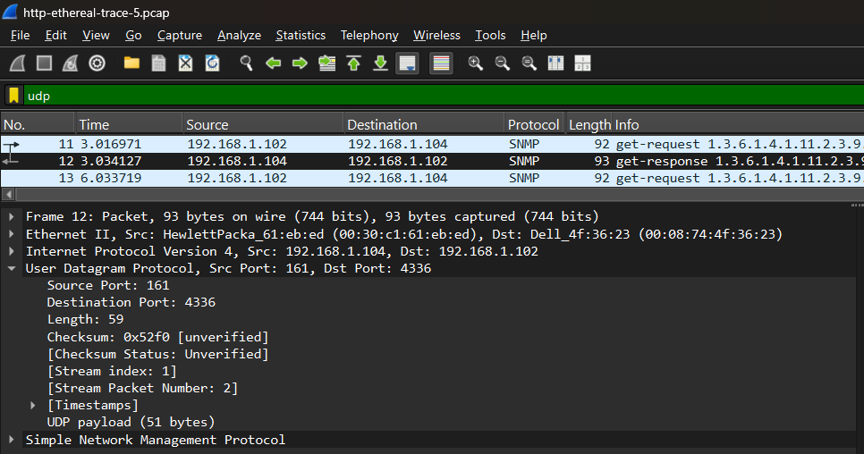
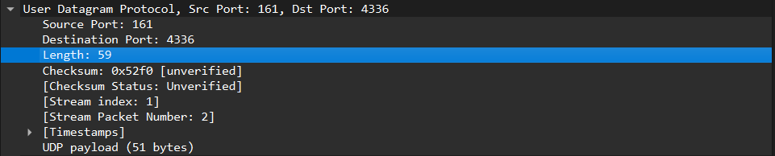
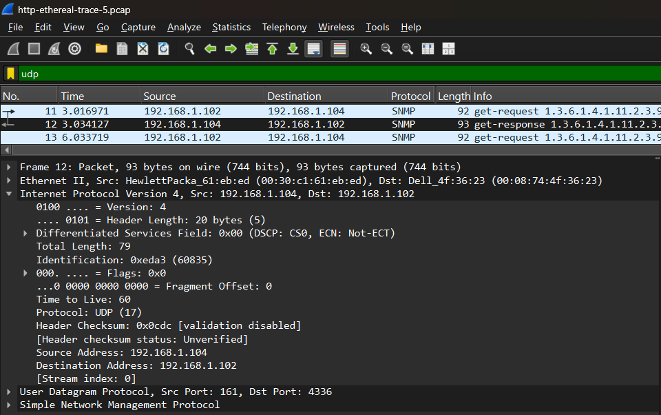
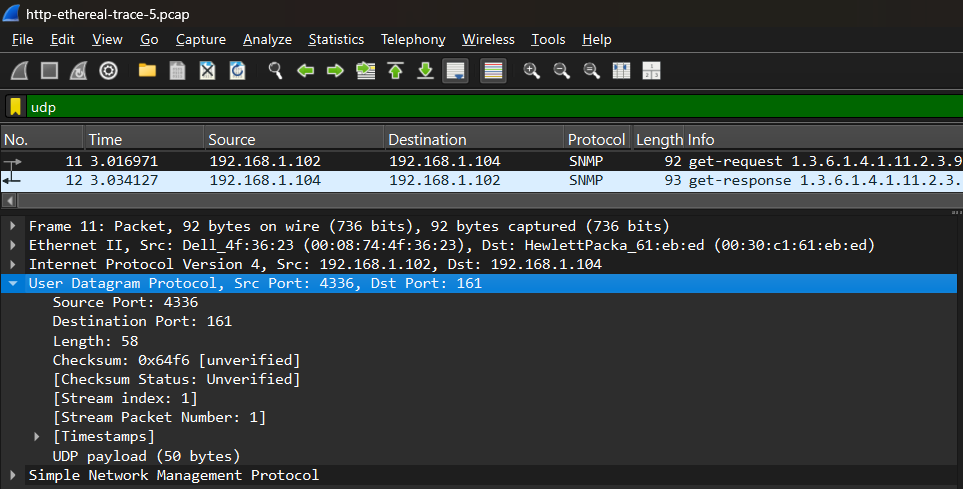
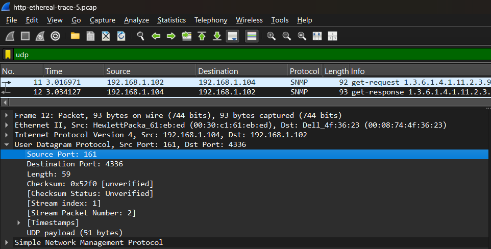

# UDP
UDP (User Datagram Protocol) merupakan salah satu protokol pada lapisan transport di model TCP/IP yang berfungsi untuk mengirim data secara tanpa koneksi (connectionless). Ini berarti UDP mengirimkan data tanpa harus melakukan proses pembentukan koneksi terlebih dahulu sebelum transmisi berlangsung.

## Langkah-Langkah Praktikum

1. Download file http://gaia.cs.umass.edu/wireshark-labs/wireshark-traces.zip
    

2. Extract file dan cari file http-ethereal-trace-5
    

3. Klik kanan pada file tersebut, kemudian buka dengan wireshark
    

4. Lakukan filter UDP dan pilih salah satu paket UDP
    

### Menjawab Pertanyaan
1) Field UDP
    
    Jawab: Terdapat 4 field : Source Port, Destination Port, Length, Checksum

2) Panjang tiap field Bedasarkan teori UDP :
    Jawab: 
    - Source Port = 2 byte
    - Destination Port = 2 byte
    - Length = 2 byte
    - Checksum = 2 byte Maka total = 2+2+2+2 = 8 byte

3) Length
    
    Jawab: Nilai Length (59) pada protokol UDP menunjukkan keseluruhan panjang segmen UDP yang terdiri dari header sebesar 8 byte dan data/payload. Untuk mengetahui ukuran data yang dikirim, maka panjang total dikurangi ukuran header, yaitu 59 - 8 = 51 byte. Dengan demikian, ukuran data yang dibawa oleh paket UDP tersebut adalah 51 byte, dan hasil ini sesuai dengan informasi yang ditampilkan pada Wireshark yaitu UDP payload (51 byte).

4) Jumlah maksimum byte UDP
    Jawab: Header UDP memiliki ukuran tetap sebesar 8 byte, sedangkan ukuran maksimum paket IP adalah 65535 byte. Dalam paket IPv4, header IP standar berukuran 20 byte. Oleh karena itu, kapasitas maksimum data (payload) UDP dapat dihitung dengan mengurangi ukuran total IP dengan header IP dan header UDP: 65535 - 20 - 8 = 65507 byte. Jadi, ukuran maksimum payload yang dapat dikirim melalui UDP adalah 65507 byte.

5) Port terbesar
    Jawab: Nomor port terbesar yang dapat digunakan pada protokol UDP adalah 65535. Hal ini karena field source port dan destination port pada header UDP masing-masing berukuran 16 bit. Dengan panjang 16 bit, jumlah nilai maksimum yang dapat direpresentasikan adalah 2¹⁶ - 1 = 65535. Oleh sebab itu, rentang nomor port UDP adalah 0 sampai 65535.

6) Nomor protokol UDP
    
    Jawab: Nomor protokol UDP adalah 17 (desimal) atau 0x11 (heksadesimal)

7) Hubungan port
    
    
    Jawab:
    - REQUEST -> Source Port : 4336 & Destination Port : 161
    - RESPONSE -> Source Port : 161 & Destination Port : 4336
    - Nomor port pada paket balasan merupakan kebalikan dari paket permintaan, di mana port sumber dan tujuan saling bertukar