# TCP
TCP (Transmission Control Protocol) merupakan protokol pada lapisan transport yang bersifat connection-oriented, yaitu proses pengiriman data harus diawali dengan pembentukan koneksi terlebih dahulu. TCP memastikan data dikirim secara andal melalui penggunaan mekanisme seperti sequence number, acknowledgment, flow control, dan congestion control.

## Analisis Transfer File Menggunakan Protocol TCP
Berikut Langkah-Langkahnya:
1. Download file http://gaia.cs.umass.edu/wireshark-labs/alice.txt

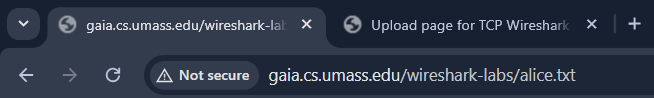

2. Buka browser http://gaia.cs.umass.edu/wireshark-labs/TCP-wireshark-file1.html dan pilih file alice.txt

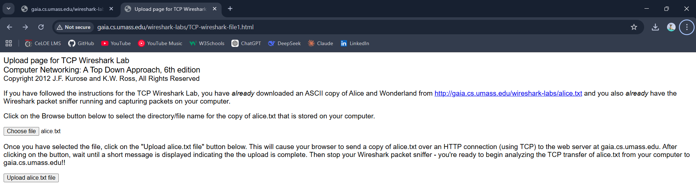

3. Buka wireshark, kemudian pilih wif dan start

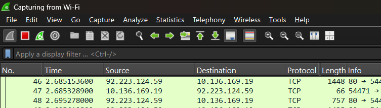

4. Kembali ke browser klik Upload alice.txt hingga muncul tampilan “Congratulations”

5. Stop wireshark kemudian filter "tcp"
    
    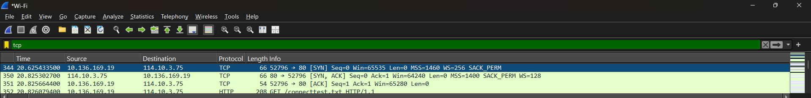
    - Paket yang muncul terdiri dari segmen TCP serta beberapa paket HTTP. Ini berarti bahwa proses upload file dilakukan menggunakan protokol HTTP yang berjalan di atas
    - Paket SYN digunakan untuk memulai koneksi TCP antara client dan server (proses three-way handshake), bukan untuk mengirim file. Proses ini memastikan bahwa koneksi siap digunakan sebelum data ditransfer. Setelah koneksi berhasil dibuat, data file akan dikirim dalam beberapa segmen kecil melalui TCP. Hal ini terjadi karena TCP membagi data menjadi bagian-bagian kecil agar pengiriman lebih efisien dan dapat dikontrol
    
    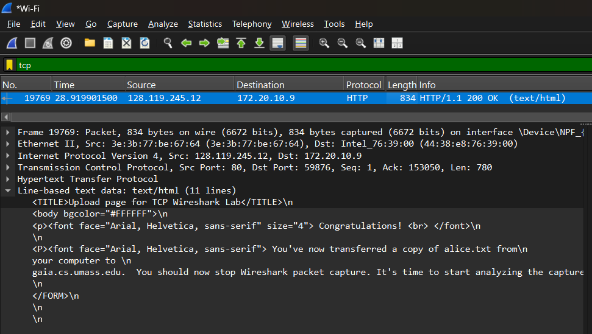
    - Selanjutnya, setelah proses upload selesai, server mengirimkan respon HTTP/1.1 200 OK. Pesan ini menandakan bahwa file telah berhasil diterima dan diproses oleh server. Setelah itu, halaman web menampilkan pesan “Congratulations” sebagai indikasi bahwa proses upload berhasil

### Menjawab Pertanyaan
1) IP dan port TCP komputer klien mencari data di filter "HTTP" dan pilih paket POST
    - IP Server: 128.119.245.12
    
    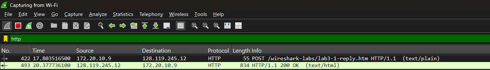
    - Port server : 52551
    
    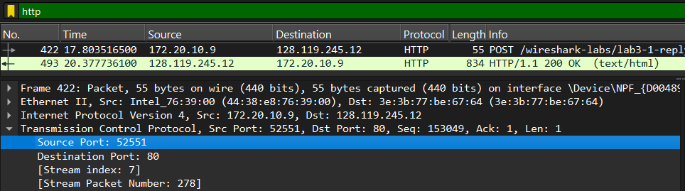
    
2) IP dan port TCP server mencari data di filter "HTTP" dan pilih paket HTTP/1.1 200 OK
    - IP Server: 172.20.10.9
    
    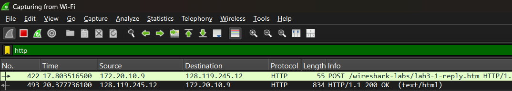
    - Port server : 80
    
    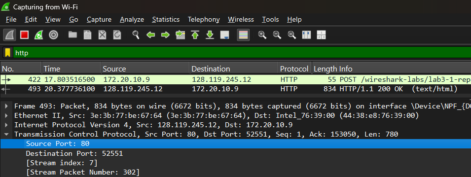

#  Dasar TCP
## Berikut Langkah-Langkahnya:
1. Download dan extrak file http://gaia.cs.umass.edu/wireshark-labs/wireshark-traces.zip
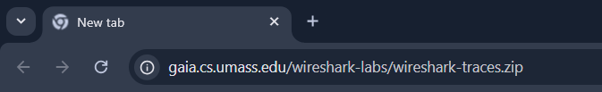

2. Buka file dan pilih paket paket tcp-ethereal-trace-1, buka dengan wireshark
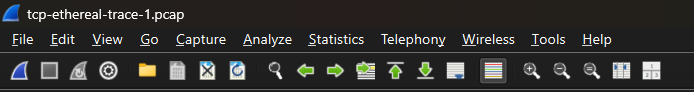

### Menjawab Pertanyaan
1) Nomor urut SYN, mencari data di filter tcp.flags.syn == 1 && tcp.flags.ack == 0
    
    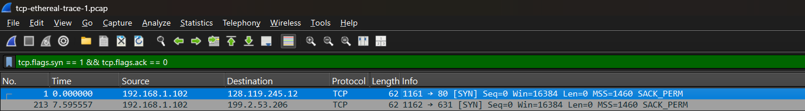
    - Nomor urut pada segmen TCP SYN adalah 0. Segmen ini teridentifikasi sebagai SYN karena memiliki flag SYN pada bagian TCP Flags.
   
    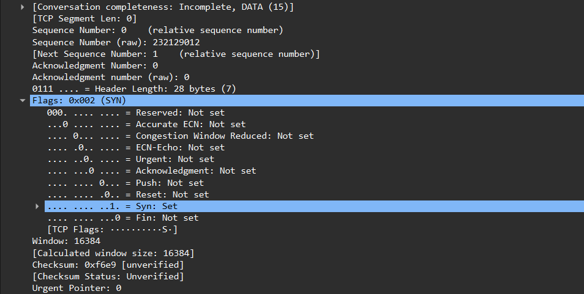

2) SYN-ACK, mencari data di filter tcp.flags.syn == 1 && tcp.flags.ack == 1
    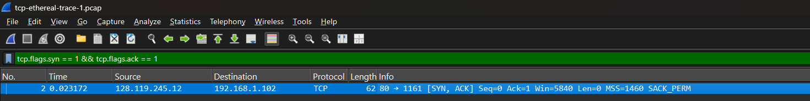
    - Nomor urut (sequence number) pada segmen SYN-ACK adalah 0, sedangkan nilai acknowledgment adalah 1. Nilai acknowledgment diperoleh dari sequence number pada segmen SYN sebelumnya yang ditambah 1. Segmen ini dapat diidentifikasi sebagai SYN-ACK karena memiliki flag SYN dan ACK pada bagian TCP Flags
    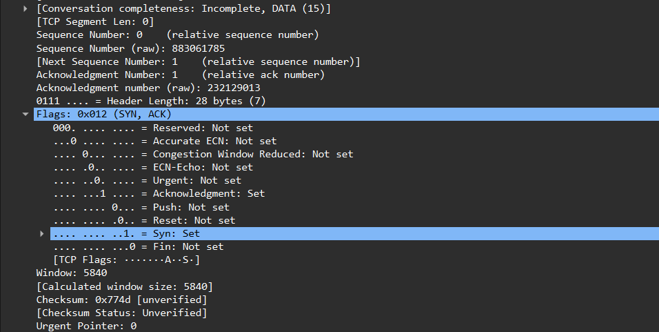

3) Sequence number POST, mencari data di filter tcp.port == 1161 && tcp contains "POST"
    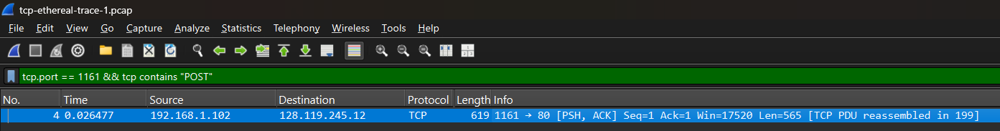
    - Nomor urut segmen TCP yang berisi perintah HTTP POST adalah 1
    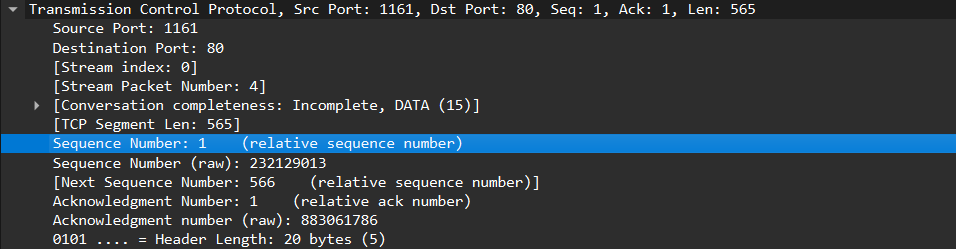

4) 6 segmen pertama + RTT
    
    - Nilai RTT diperoleh dari selisih waktu antara pengiriman segmen TCP dan penerimaan acknowledgment. Berdasarkan grafik Round Trip Time, nilai RTT berkisar antara sekitar 100 ms hingga 300 ms. Nilai RTT ini bervariasi karena dipengaruhi oleh kondisi jaringan selama proses transfer

5) Panjang 6 segmen
   
    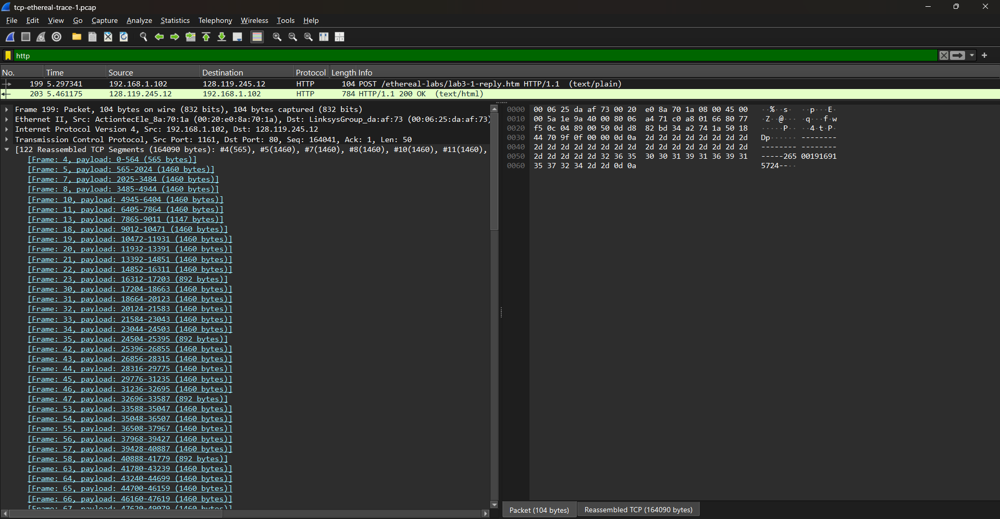
   
    - Panjang 6 segmen adalah 8760 byte

6) Buffer receiver
    
    
    - Nilai minimum ruang buffer yang tersedia pada penerima adalah 5840 byte, yang terlihat dari nilai window size pada segmen TCP

7) Retransmission
    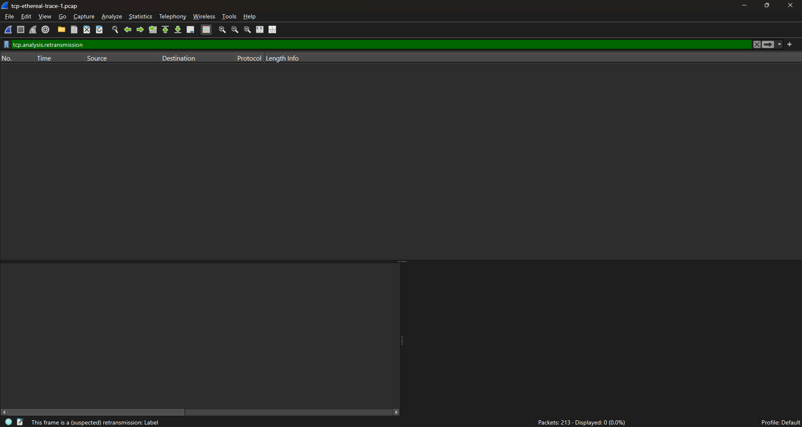
    - Tidak ditemukan retransmission / ditemukan retransmission. Hal ini dapat dilihat dari tidak adanya / adanya label “TCP Retransmission” pada Wireshark.

8) ACK behavior
    
    - Jumlah data yang di-ACK tidak tetap dan bisa banyak. Penerima dapat mengakui beberapa segmen sekaligus, tidak selalu satu per satu

9) Thoroughtput
    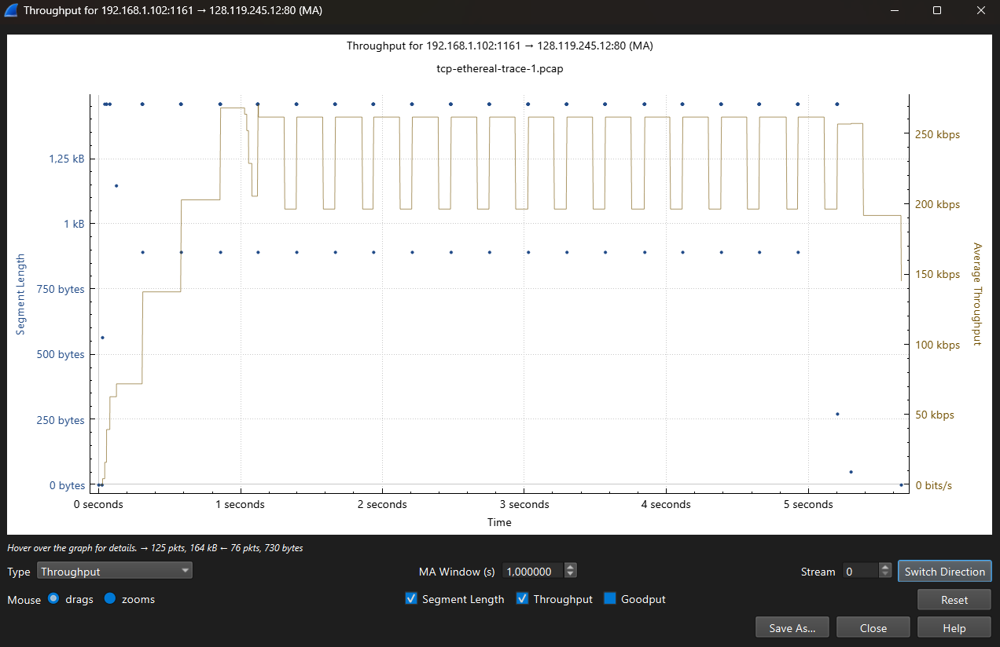
    - Throughput adalah jumlah data yang ditransfer per satuan waktu. Berdasarkan grafik throughput, kecepatan transfer meningkat secara bertahap hingga mencapai sekitar 200 kbps hingga 270 kbps. Nilai ini menunjukkan performa koneksi TCP selama proses pengiriman data

# Congestion Control pada TCP
## Berikut Langkah-Langkahnya dan Menjawab Pertanyaan:
1. Identifikasi Slow Start & Congestion Avoidance (file tcp-ethereal-trace-1)

    - Buka file tcp-ethereal-trace-1 dengan wireshark
    - Filter "TCP"
    - Klik Statistics -> TCP Stream Graph -> Time-Sequence Graph (Stevens)
    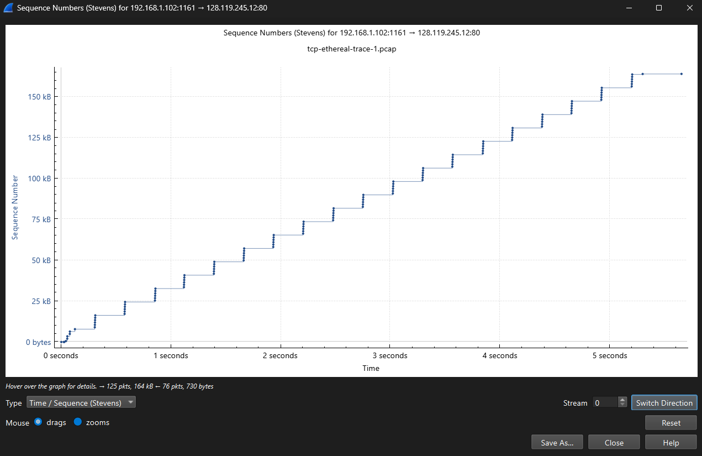
    - Fase slow start terjadi pada awal koneksi (0 – ±1 detik) dengan pertumbuhan eksponensial. Fase ini berakhir ketika mencapai threshold, ditandai perubahan grafik menjadi linear. Selanjutnya TCP masuk ke fase congestion avoidance dengan pertumbuhan linear. Data nyata menunjukkan sedikit deviasi dari teori karena kondisi jaringan seperti delay dan variasi ACK. Koneksi TCP pada grafik dapat dikatakan relatif stabil karena tidak menunjukkan penurunan drastis pada sequence number yang mengindikasikan packet loss besar atau timeout. Namun, grafik tidak sepenuhnya halus seperti pada model TCP ideal.

2. Identifikasi Slow Start & Congestion Avoidance (alice.txt)

    - Start wireshark
    - Uploud file alice.txt ke http://gaia.cs.umass.edu/wireshark-labs/TCP-wireshark-file1.html
    - Kembali ke wireshark dan filter "TCP"
    - Klik Statistics -> TCP Stream Graph -> Time-Sequence Graph (Stevens)
    
    - Pada grafik kedua, fase slow start terjadi pada awal koneksi dengan pertumbuhan eksponensial yang sangat cepat. Transisi ke congestion avoidance terjadi lebih cepat dibandingkan grafik sebelumnya. Hal ini menunjukkan bahwa koneksi Wi-Fi memiliki respon yang lebih cepat, namun juga lebih rentan terhadap variasi delay. Secara umum, koneksi tetap stabil, meskipun tidak sepenuhnya mengikuti perilaku ideal TCP akibat kondisi jaringan nirkabel.