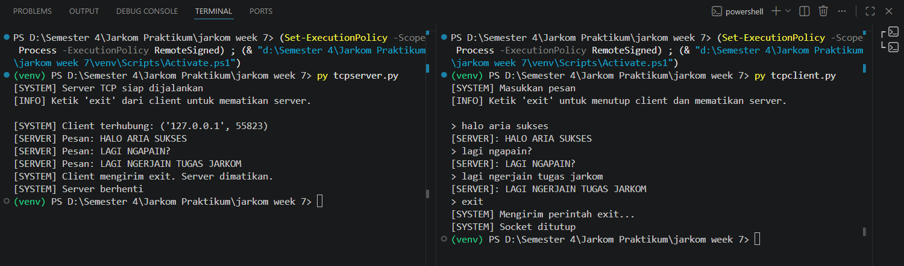
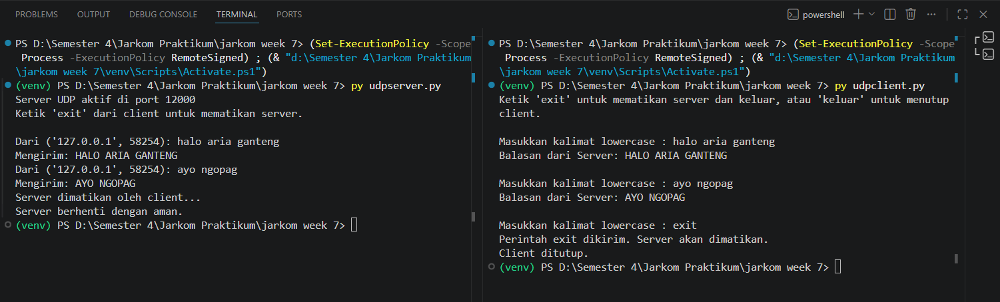

# SOCKET PROGRAMMING
Socket programming merupakan metode yang digunakan agar dua komputer dapat berkomunikasi melalui jaringan dengan memanfaatkan socket sebagai media penghubung. Dalam mekanismenya, terdapat dua pihak utama, yaitu client yang bertugas mengirimkan permintaan atau data, dan server yang menerima lalu memberikan respons. Komunikasi ini dapat menggunakan protokol TCP yang lebih andal karena memastikan data terkirim dengan baik, maupun UDP yang menawarkan kecepatan lebih tinggi tetapi tanpa jaminan keakuratan pengiriman. Dengan demikian, socket programming memungkinkan perangkat dalam jaringan untuk melakukan pertukaran data secara langsung.

## Implementasi TCP
### TCP Client

```python
from socket import *

serverName = "localhost"
serverPort = 12000

clientSocket = socket(AF_INET, SOCK_STREAM)
clientSocket.connect((serverName, serverPort))

print("[SYSTEM] Masukkan pesan")
print("[INFO] Ketik 'exit' untuk menutup client dan mematikan server.\n")

running = True

while running:
    message = input("> ")

    clientSocket.send(message.encode())

    if message.lower() == "exit":
        print("[SYSTEM] Mengirim perintah exit...")
        running = False
        break

    modifiedMessage = clientSocket.recv(2048)
    print("[SERVER]:", modifiedMessage.decode())

clientSocket.close()
print("[SYSTEM] Socket ditutup")
```

### TCP Server

```python
from socket import *

serverPort = 12000

serverSocket = socket(AF_INET, SOCK_STREAM)
serverSocket.bind(('', serverPort))

serverSocket.listen(1)

print("[SYSTEM] Server TCP siap dijalankan")
print("[INFO] Ketik 'exit' dari client untuk mematikan server.\n")

running = True

while running:
    connectionSocket, addr = serverSocket.accept()

    print("[SYSTEM] Client terhubung:", addr)

    while True:
        message = connectionSocket.recv(2048).decode()

        if not message:
            break

        if message.lower() == "exit":
            print("[SYSTEM] Client mengirim exit. Server dimatikan.")
            running = False
            break

        modifiedMessage = message.upper()
        print("[SERVER] Pesan:", modifiedMessage)

        connectionSocket.send(modifiedMessage.encode())

    connectionSocket.close()

serverSocket.close()
print("[SYSTEM] Server berhenti")
```

### Alur TCP
1. Server dijalankan terlebih dahulu
2. Client melakukan koneksi ke server
3. Client mengirim data
4. Server memproses data
5. Server mengirim hasil ke client
6. Client menampilkan hasil

Output program socket di terminal:


## Implementasi UDP
### UDP Client

```python
from socket import *

serverName = '127.0.0.1'
serverPort = 12000

clientSocket = socket(AF_INET, SOCK_DGRAM)
clientSocket.settimeout(5)

print("Ketik 'exit' untuk mematikan server dan keluar, atau 'keluar' untuk menutup client.\n")

try:
    while True:
        message = input("Masukkan kalimat lowercase : ")

        if not message:
            continue

        # keluar client saja
        if message.lower() == 'keluar':
            print("Menutup client...")
            break

        # kirim exit untuk matikan server
        clientSocket.sendto(message.encode(), (serverName, serverPort))

        if message.lower() == 'exit':
            print("Perintah exit dikirim. Server akan dimatikan.")
            break

        try:
            response, _ = clientSocket.recvfrom(2048)
            print("Balasan dari Server:", response.decode(), "\n")

        except TimeoutError:
            print("Server tidak merespons (Timeout).\n")

finally:
    clientSocket.close()
    print("Client ditutup.")
```

### UDP Server

```python
from socket import *

serverPort = 12000

serverSocket = socket(AF_INET, SOCK_DGRAM)
serverSocket.bind(('', serverPort))

# 🔥 PENTING: kasih timeout supaya tidak nge-hang di recvfrom
serverSocket.settimeout(1)

print(f"Server UDP aktif di port {serverPort}")
print("Ketik 'exit' dari client untuk mematikan server.\n")

running = True

try:
    while running:
        try:
            message, clientAddress = serverSocket.recvfrom(2048)
            original_message = message.decode().strip()

            if original_message.lower() == 'exit':
                print("Server dimatikan oleh client...")
                running = False
                continue

            modified = original_message.upper()

            print(f"Dari {clientAddress}: {original_message}")
            print(f"Mengirim: {modified}")

            serverSocket.sendto(modified.encode(), clientAddress)

        except TimeoutError:
            # ini penting supaya loop tetap jalan & bisa cek running
            continue

finally:
    serverSocket.close()
    print("Server berhenti dengan aman.")
```

### Alur UDP
1. Server dijalankan
2. Client langsung mengirim data tanpa koneksi
3. Server menerima data
4. Server memproses
5. Server mengirim balasan
6. Client menerima hasil

Output program socket di terminal:


## Kesimpulan
Socket merupakan mekanisme komunikasi yang memungkinkan pertukaran data antar perangkat dalam jaringan komputer. TCP (Transmission Control Protocol) digunakan untuk komunikasi yang membutuhkan keandalan tinggi karena harus membentuk koneksi terlebih dahulu sebelum mengirim data. Protokol ini mampu menjamin data terkirim dengan aman, lengkap, dan sesuai urutan, tetapi prosesnya cenderung lebih lambat karena adanya pengelolaan koneksi dan pengecekan kesalahan. Sebaliknya, UDP (User Datagram Protocol) lebih cocok untuk komunikasi yang mengutamakan kecepatan karena tidak memerlukan pembentukan koneksi, sehingga pengiriman data menjadi lebih cepat dan sederhana. Namun, UDP tidak menjamin data akan sampai, lengkap, atau diterima sesuai urutan pengiriman.