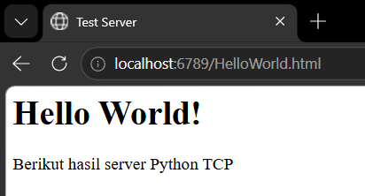
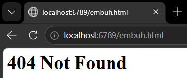
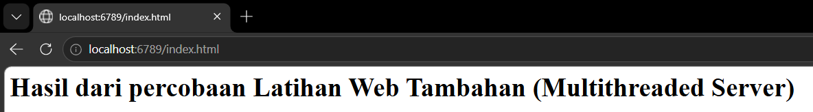

# MODUL 9 : WEB SERVER
Web server merupakan komponen yang berperan dalam melayani komunikasi antara klien dan server pada jaringan internet. Tugas utamanya adalah menerima permintaan dari pengguna melalui browser, kemudian mengirimkan respons berupa halaman web atau data yang diminta. Komunikasi tersebut umumnya menggunakan protokol HTTP yang berjalan di atas TCP sehingga proses pertukaran data dapat berlangsung dengan baik dan terjamin.

## Berikut Langkah Membuat Web Server Sederhana
1. Membuat folder jarkomModul9, lalu buat file serverweb.py
2. Masukkan kode program
```python
from socket import *
import sys

# membuat socket server (TCP)
serverSocket = socket(AF_INET, SOCK_STREAM)

# Prepare a server socket
serverPort = 6789
serverSocket.bind(('', serverPort))
serverSocket.listen(1)

while True:
    # Establish the connection
    print('Ready to serve...')
    connectionSocket, addr = serverSocket.accept()

    try:
        # menerima request dari client
        message = connectionSocket.recv(1024).decode()
        print(message)

        # mengambil nama file
        filename = message.split()[1]

        # membuka file
        f = open(filename[1:])
        outputdata = f.read()

        # Send HTTP header
        connectionSocket.send("HTTP/1.1 200 OK\r\n".encode())
        connectionSocket.send("Content-Type: text/html\r\n".encode())
        connectionSocket.send("\r\n".encode())

        # kirim isi file
        for i in range(len(outputdata)):
            connectionSocket.send(outputdata[i].encode())

        connectionSocket.send("\r\n".encode())
        connectionSocket.close()

    except IOError:
        # kirim 404 jika file tidak ada
        connectionSocket.send("HTTP/1.1 404 Not Found\r\n".encode())
        connectionSocket.send("Content-Type: text/html\r\n".encode())
        connectionSocket.send("\r\n".encode())
        connectionSocket.send("<html><body><h1>404 Not Found</h1></body></html>".encode())

        # tutup koneksi
        connectionSocket.close()

serverSocket.close()
sys.exit()
```
3. Buat file HelloWorld.html di folder yang sama
4. Isi dengan
```html
<html>
<head>
    <title>Test Server</title>
</head>
<body>
    <h1>Hello World!</h1>
    <p>Berikut hasil server Python TCP</p>
</body>
</html>
```
5. Running program file serverweb.py di terminal (py serverweb.py)
6. Buka browser ketikan URL: http://localhost:6789/HelloWorld.html
7. Buka tab lain dan ketikan ERL: http://localhost:6789/salah.html

## Analisis Program
Program diawali dengan pembuatan socket TCP menggunakan modul socket. Socket tersebut kemudian dikaitkan dengan port 6789 dan diatur dalam mode listening agar dapat menerima koneksi dari klien. Ketika browser mengirimkan request, server akan membaca permintaan tersebut dan mengambil nama file yang diminta.

Apabila file tersedia pada direktori server, program akan mengirimkan respons HTTP dengan status 200 OK beserta isi file HTML. Sebaliknya, jika file tidak ditemukan, server akan memberikan respons 404 Not Found. Karena server ini menggunakan pendekatan single-threaded, setiap permintaan diproses secara bergantian sehingga hanya satu klien yang dapat dilayani pada satu waktu.

## Hasil Percobaan

1. Pada pengujian pertama, browser berhasil menampilkan isi file HTML yang diminta. Hal ini menunjukkan bahwa server dapat menerima request dan mengirimkan respons dengan benar.



Server berhasil menampilkan isi file HTML pada browser.

2. Pada pengujian kedua, ketika file yang diminta tidak tersedia, browser menampilkan pesan 404 Not Found. Hasil tersebut membuktikan bahwa server mampu menangani kesalahan permintaan dengan baik.



Pada bercobaan kedua, server menampilkan "404 Not Found". Hal ini menunjukkan bahwa server berhasil menangani request valid dan error dengan benar.

## Latihan Web Tambahan (Multithreaded Server)
1. Membuat file server.py
2. Masukkan kode program
```python
from socket import *
import threading

def handle_client(connectionSocket):
    try:
        # menerima pesan user
        message = connectionSocket.recv(1024).decode() # decode = 10101010 = "message"

        # index.html, hello.html
        # message isinya = /GET /index.html HTTP/1.1
        message = message[4:15]
        print(message)
        # filename = message.split()[1]

        # membuka index.html serta menghilangkan "/"
        f = open(message[1:])

        # membaca file html
        outputData = f.read()

        # kirim respon
        connectionSocket.send(
            "HTTP/1.1 200 OK\r\n\r\n".encode()
        )

        # kirim data
        connectionSocket.sendall(outputData.encode())

        # tutup koneksi
        connectionSocket.close()
    
    except IOError:
        # kirim respon bila tidak ditemukan
        connectionSocket.send(
            "HTTP/1.1 404 Not Found\r\n\r\n".encode()
        )

        # kirim data
        connectionSocket.send(
            "<h1>404 Not Found</h1>".encode()
        )

        # tutup koneksinya
        connectionSocket.close()


serverSocket = socket(AF_INET, SOCK_STREAM)
serverSocket.bind(('', 6789))
serverSocket.listen(5) # dapat menerima sebanyak 5 client
print("[SYSTEM] server is running...")

while True:
    connectionSocket, addr =  serverSocket.accept()

    # membuat thread dan target threadnya, beseerta parameter
    thread = threading.Thread(
        target = handle_client,
        args = (connectionSocket,)
        )
    # menjalankan
    thread.start()
```
3. Buat file index.html di folder yang sama
4. Isi dengan
```html
<h1>Hasil dari percobaan Latihan Web Tambahan (Multithreaded Server)</h1>
```
5. Running program file server.py di terminal (py server.py)
6. Buka browser ketikan URL: http://localhost:6789/index.html

## Analisis Program
Pada implementasi ini, server dikembangkan dengan konsep multithreading. Setiap koneksi yang diterima akan ditangani oleh thread baru yang menjalankan fungsi handle_client(). Dengan cara tersebut, beberapa klien dapat dilayani secara bersamaan tanpa harus menunggu proses dari klien lain selesai terlebih dahulu.

Pendekatan multithreading memberikan peningkatan efisiensi karena server dapat memproses banyak permintaan dalam waktu yang sama. Hal ini sangat bermanfaat pada lingkungan jaringan yang memiliki banyak pengguna aktif.

## Hasil Percobaan


Hasil pengujian menunjukkan bahwa server mampu menangani beberapa request secara simultan. Ketika beberapa browser atau tab dibuka secara bersamaan, seluruh permintaan tetap dapat diproses dengan baik tanpa mengalami gangguan. Kondisi ini menunjukkan bahwa penggunaan thread berhasil meningkatkan kemampuan server dalam melayani banyak klien.

## Kesimpulan
Berdasarkan praktikum yang telah dilakukan, web server sederhana berhasil dibuat menggunakan socket TCP pada Python. Server dapat menerima request HTTP, mencari file yang diminta, dan mengirimkan respons yang sesuai kepada klien.

Selain itu, implementasi multithreaded server menunjukkan peningkatan performa dibandingkan server sederhana. Dengan memanfaatkan thread, server dapat menangani banyak koneksi secara bersamaan sehingga pelayanan terhadap klien menjadi lebih efisien dan responsif.