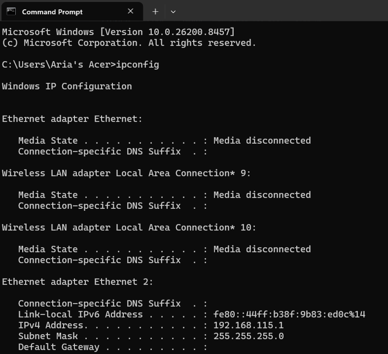
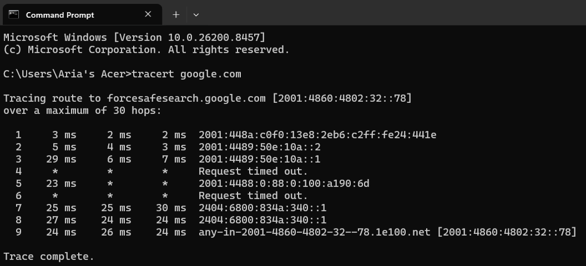
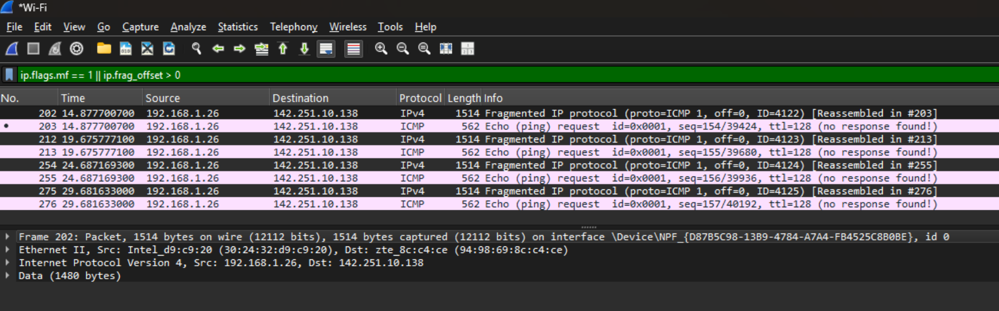

# MODUL 10 : IP

IP Address (Internet Protocol Address) merupakan alamat unik yang digunakan untuk mengidentifikasi perangkat pada suatu jaringan, baik jaringan lokal maupun internet. Fungsi utama IP Address adalah memastikan data dapat dikirim ke perangkat tujuan yang tepat. Secara umum IP Address dibagi menjadi dua jenis, yaitu IPv4 yang menggunakan 32-bit alamat dan IPv6 yang menggunakan 128-bit alamat.

Subnetting digunakan untuk membagi alamat IP menjadi Network ID dan Host ID sehingga pengelolaan jaringan menjadi lebih efisien.

## Mengamati IP Address

### Langkah-Langkah

1. Buka Command Prompt (CMD).
2. Ketik perintah ipconfig
3. Amati informasi IP Address, Subnet Mask, dan Default Gateway yang muncul.

## Analisis Program

- Perintah `ipconfig` digunakan untuk menampilkan konfigurasi jaringan yang sedang digunakan oleh komputer. Informasi yang ditampilkan meliputi alamat IP, subnet mask, default gateway, serta alamat IPv6 yang dimiliki oleh setiap adapter jaringan.
- Berdasarkan hasil pengamatan, adapter yang aktif adalah **Ethernet 2** dengan alamat IPv4 **192.168.115.1** dan subnet mask **255.255.255.0**. Alamat tersebut termasuk ke dalam jaringan privat kelas C yang umum digunakan pada jaringan lokal (LAN).
- Selain IPv4, perangkat juga memiliki alamat **Link-local IPv6 Address** yaitu **fe80::44ff:b38f:9b83:ed0c%14**. Alamat ini secara otomatis diberikan oleh sistem operasi dan digunakan untuk komunikasi dalam satu segmen jaringan IPv6.
- Pada hasil konfigurasi tidak ditemukan nilai **Default Gateway**, yang menunjukkan bahwa adapter tersebut kemungkinan digunakan sebagai jaringan virtual, hotspot, atau adapter internal yang tidak terhubung langsung ke internet.
- Sementara itu, adapter Ethernet dan Wireless LAN lainnya berstatus **Media disconnected**, yang menandakan bahwa adapter tersebut tidak sedang terhubung ke jaringan apa pun pada saat pengamatan dilakukan.
- Pada hasil pengamatan, perangkat menggunakan IP Address **10.218.10.188** yang termasuk dalam kelas A private. Subnet mask yang digunakan adalah **255.255.240.0** atau setara dengan prefix **/20**. Dengan konfigurasi tersebut diperoleh Network ID **10.218.0.0** dan jaringan mampu menampung ribuan host. Selain itu terdapat Default Gateway **10.218.0.253** yang berfungsi sebagai penghubung ke jaringan internet.

## Hasil Percobaan

Hasil perintah `ipconfig` berhasil menampilkan konfigurasi jaringan pada komputer. Terlihat bahwa adapter Ethernet 2 memiliki alamat IPv4 192.168.115.1 dengan subnet mask 255.255.255.0. Selain itu, sistem juga memiliki alamat IPv6 link-local yang digunakan untuk komunikasi lokal pada jaringan IPv6. Beberapa adapter lain berstatus *Media disconnected* karena tidak sedang digunakan atau tidak terhubung ke jaringan.

## Traceroute

Traceroute merupakan teknik yang digunakan untuk mengetahui jalur yang dilalui paket data dari komputer menuju suatu tujuan pada jaringan internet. Setiap router yang dilewati akan ditampilkan sebagai hop.

### Langkah-Langkah

1. Buka Command Prompt (CMD).
2. Jalankan perintah tracert google.com
3. Amati jalur yang dilewati paket data.

## Analisis Program

- Perintah `tracert google.com` digunakan untuk mengetahui jalur yang dilewati paket data dari komputer menuju server Google. Traceroute bekerja dengan memanfaatkan nilai TTL (Time To Live) yang akan berkurang setiap kali paket melewati router. Ketika nilai TTL habis, router akan mengirimkan pesan ICMP sehingga jalur yang dilewati paket dapat diketahui.
- Berdasarkan hasil pengamatan, tujuan traceroute adalah server Google dengan alamat IPv6 **2001:4860:4802:32::78**. Paket data mencapai tujuan dalam **9 hop** sebelum proses traceroute selesai.
- Hop pertama hingga ketiga merupakan perangkat jaringan lokal dan jaringan milik penyedia layanan internet (ISP). Pada hop keempat dan keenam muncul pesan **Request Timed Out**, yang menunjukkan bahwa router pada jalur tersebut tidak memberikan respons terhadap permintaan traceroute. Kondisi ini umum terjadi karena beberapa router dikonfigurasi untuk membatasi atau menolak paket traceroute demi alasan keamanan.
- Selanjutnya paket diteruskan melalui beberapa router pada jaringan Google yang ditunjukkan oleh alamat IPv6 **2404:6800:834a:340::1**. Pada hop terakhir, paket berhasil mencapai tujuan yaitu **any-in-2001-4860-4802-32--78.1e100.net [2001:4860:4802:32::78]**, yang merupakan salah satu server Google.
- Waktu tempuh yang diperoleh berkisar antara **2 ms hingga 30 ms**, menunjukkan bahwa koneksi jaringan berada dalam kondisi cukup baik dengan latensi yang relatif rendah. Meskipun terdapat beberapa hop yang tidak memberikan respons, paket tetap berhasil mencapai tujuan sehingga tidak menunjukkan adanya gangguan koneksi yang signifikan.

## Hasil Percobaan

Hasil traceroute menunjukkan bahwa paket data berhasil mencapai server Google dengan alamat IPv6 2001:4860:4802:32::78 setelah melewati 9 hop. Beberapa router tidak memberikan respons sehingga muncul pesan *Request Timed Out*, namun hal tersebut tidak menghambat paket untuk mencapai tujuan akhir. Waktu tempuh yang relatif rendah menunjukkan bahwa kualitas koneksi jaringan berada dalam kondisi baik.

## ICMP, MTU, dan TTL

### ICMP

ICMP (Internet Control Message Protocol) merupakan protokol yang digunakan untuk mengirimkan pesan kontrol dan informasi kesalahan dalam jaringan. ICMP banyak digunakan pada proses ping dan traceroute.

### MTU

MTU (Maximum Transmission Unit) adalah ukuran maksimum data yang dapat dikirim dalam satu paket pada media jaringan. Pada jaringan Ethernet, nilai MTU umumnya sebesar 1500 byte.

### TTL

TTL (Time To Live) merupakan batas jumlah hop yang dapat dilewati suatu paket. Setiap kali paket melewati router, nilai TTL akan berkurang satu. Jika TTL mencapai nol, paket akan dibuang untuk mencegah terjadinya looping pada jaringan.

## Fragmentasi

Fragmentasi merupakan proses pemecahan paket menjadi beberapa bagian yang lebih kecil karena ukuran paket melebihi nilai MTU jaringan.

### Langkah-Langkah

1. Jalankan Wireshark dan pilih interface Wi-Fi yang aktif
2. Klik Start Capture
3. Buka Command Prompt
4. Jalankan perintah: ping google.com -l 2000

5. Kembali ke Wireshark dan gunakan filter: ip.flags.mf == 1 || ip.frag_offset > 0

## Analisis Program

- Pada percobaan ini dilakukan pengiriman paket ICMP berukuran besar menggunakan perintah `ping google.com -l 2000`. Ukuran paket yang dikirim melebihi nilai MTU Ethernet yang umumnya sebesar 1500 byte sehingga sistem harus melakukan fragmentasi sebelum paket dapat dikirim melalui jaringan.
- Berdasarkan hasil capture Wireshark dengan filter `ip.flags.mf == 1 || ip.frag_offset > 0`, terlihat beberapa paket dengan keterangan **Fragmented IP protocol (proto=ICMP)**. Paket-paket tersebut memiliki ukuran sebesar **1514 bytes**, yang menunjukkan bahwa paket ICMP asli telah dipecah menjadi beberapa fragmen agar dapat melewati jaringan dengan batas MTU yang tersedia.
- Pada hasil pengamatan juga ditemukan informasi **Reassembled in #203**, **Reassembled in #213**, dan seterusnya. Informasi ini menunjukkan bahwa Wireshark berhasil menggabungkan kembali fragmen-fragmen tersebut menjadi paket ICMP utuh untuk dianalisis.
- Alamat sumber paket adalah **192.168.1.26**, sedangkan alamat tujuan adalah **142.251.10.138** yang merupakan salah satu alamat server Google. Paket yang telah direkonstruksi kembali terlihat sebagai **ICMP Echo Request** dengan ukuran data yang lebih besar dibandingkan paket ping biasa.
- Dari hasil tersebut dapat disimpulkan bahwa proses fragmentasi berhasil terjadi karena ukuran paket ICMP melebihi batas MTU jaringan. Paket dipecah menjadi beberapa fragmen saat dikirim dan kemudian digabungkan kembali (reassembly) sehingga dapat diproses oleh perangkat tujuan.

## Hasil Percobaan

Hasil capture Wireshark menunjukkan adanya paket **Fragmented IP Protocol (ICMP)** dengan ukuran 1514 bytes. Paket tersebut berasal dari alamat IP 192.168.1.26 menuju 142.251.10.138. Informasi *Reassembled in* menunjukkan bahwa fragmen-fragmen paket berhasil digabungkan kembali menjadi paket ICMP Echo Request yang utuh. Hal ini membuktikan bahwa paket mengalami fragmentasi karena ukurannya melebihi nilai MTU jaringan.

## IPv6

IPv6 merupakan versi terbaru dari Internet Protocol yang dirancang untuk menggantikan IPv4. IPv6 menggunakan panjang alamat sebesar 128-bit dan ditulis dalam format heksadesimal yang dipisahkan oleh tanda titik dua (:).

### Langkah-Langkah

1. Buka file capture `ipv6_sample` menggunakan Wireshark

.png)

2. Gunakan filter: ipv6
3. Amati informasi paket yang ditampilkan

## Analisis Program

Filter IPv6 digunakan untuk menampilkan paket yang menggunakan protokol Internet Protocol Version 6. Dari hasil pengamatan terlihat alamat source dan destination menggunakan format heksadesimal yang merupakan karakteristik IPv6.

Selain itu ditemukan informasi Next Header yang menunjukkan penggunaan protokol TCP dan komunikasi berlangsung pada port 443 yang digunakan oleh layanan HTTPS.

## Hasil Percobaan

.png)

Paket IPv6 berhasil diamati menggunakan Wireshark. Hal ini menunjukkan bahwa komunikasi jaringan modern telah mendukung penggunaan IPv6 untuk mengakses layanan internet.

## Kesimpulan

Berdasarkan praktikum yang telah dilakukan, konsep IP Address, traceroute, ICMP, MTU, TTL, fragmentasi, dan IPv6 dapat dipahami dengan baik. Pengamatan menggunakan Command Prompt dan Wireshark menunjukkan bagaimana paket data dikirim, melewati berbagai router, serta mengalami fragmentasi apabila ukuran paket melebihi MTU. Selain itu, komunikasi menggunakan IPv6 juga berhasil diamati sehingga memberikan pemahaman yang lebih mendalam mengenai teknologi jaringan modern.