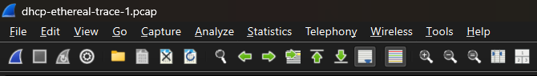
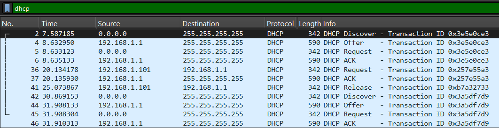

# DHCP

DHCP (Dynamic Host Configuration Protocol) merupakan protokol jaringan yang berfungsi untuk memberikan konfigurasi jaringan secara otomatis kepada perangkat yang terhubung ke jaringan. Konfigurasi yang diberikan meliputi IP Address, subnet mask, default gateway, dan DNS server. Dengan adanya DHCP, pengguna tidak perlu melakukan konfigurasi IP Address secara manual sehingga proses koneksi ke jaringan menjadi lebih mudah dan efisien.

DHCP banyak digunakan pada jaringan modern karena mampu mengelola pemberian alamat IP secara otomatis serta mengurangi kemungkinan terjadinya kesalahan konfigurasi pada perangkat klien.

## Kelebihan DHCP

1. Proses pemberian IP Address dapat dilakukan secara otomatis dan lebih cepat.
2. Mempermudah administrator jaringan dalam mengelola alamat IP.
3. Mengurangi kemungkinan terjadinya konflik penggunaan IP Address yang sama.
4. Meminimalkan kesalahan konfigurasi IP Address pada perangkat klien.
5. Sangat efisien digunakan pada jaringan yang memiliki banyak perangkat.

## Kekurangan DHCP

1. Perangkat menjadi lebih sulit dilacak karena alamat IP dapat berubah secara otomatis.
2. Membutuhkan konfigurasi dan pengelolaan server DHCP.
3. Jika server DHCP mengalami gangguan, perangkat klien tidak dapat memperoleh alamat IP.
4. Keamanan jaringan dapat berkurang apabila konfigurasi DHCP tidak dikelola dengan baik.

## Proses DORA

DORA merupakan mekanisme komunikasi yang digunakan oleh DHCP untuk memberikan alamat IP kepada klien secara otomatis. DORA merupakan singkatan dari Discover, Offer, Request, dan Acknowledgement (ACK).

### Langkah-Langkah

1. Download dan ekstrak file: http://gaia.cs.umass.edu/wireshark-labs/wireshark-traces.zip
2. Buka file capture DHCP menggunakan Wireshark.

3. Gunakan filter dhcp untuk menampilkan paket DHCP:

4. Amati urutan paket DHCP yang muncul pada hasil capture.

## Analisis Program

Filter DHCP pada Wireshark digunakan untuk menampilkan seluruh komunikasi yang terjadi antara DHCP Client dan DHCP Server. Dari hasil capture terlihat proses pemberian alamat IP secara otomatis yang berlangsung melalui empat tahapan utama, yaitu Discover, Offer, Request, dan Acknowledgement (ACK).

Proses ini memungkinkan perangkat klien memperoleh konfigurasi jaringan secara otomatis tanpa perlu melakukan pengaturan secara manual. Setiap tahap memiliki fungsi yang berbeda untuk memastikan alamat IP dapat diberikan dan digunakan dengan benar oleh klien.

## Hasil Percobaan

### 1. Discover

Pada paket pertama terlihat bahwa DHCP Client mengirimkan pesan **DHCP Discover** untuk mencari server DHCP yang tersedia pada jaringan. Karena perangkat belum memiliki alamat IP, source address yang digunakan masih **0.0.0.0**. Paket dikirim secara broadcast agar dapat diterima oleh seluruh server DHCP yang berada pada jaringan yang sama.

### 2. Offer

Pada paket kedua, server DHCP merespons dengan mengirimkan **DHCP Offer**. Paket ini berisi penawaran alamat IP beserta informasi konfigurasi jaringan lainnya seperti subnet mask, gateway, dan DNS server yang dapat digunakan oleh klien.

### 3. Request

Pada paket ketiga, klien mengirimkan **DHCP Request** sebagai tanda bahwa klien menerima dan memilih alamat IP yang ditawarkan oleh server DHCP. Permintaan ini juga memberitahukan kepada server lain bahwa klien telah menentukan pilihannya.

### 4. Acknowledgement (ACK)

Pada paket keempat, server DHCP mengirimkan **DHCP ACK (Acknowledgement)** untuk mengonfirmasi bahwa alamat IP telah resmi diberikan kepada klien. Setelah tahap ini selesai, perangkat klien dapat menggunakan konfigurasi jaringan tersebut untuk berkomunikasi dengan perangkat lain maupun mengakses internet.

Berdasarkan hasil pengamatan di Wireshark, seluruh tahapan DORA berhasil diamati dengan baik. Urutan paket Discover, Offer, Request, dan ACK menunjukkan proses pemberian alamat IP secara otomatis berjalan sesuai mekanisme DHCP.

## Kesimpulan

Berdasarkan praktikum yang telah dilakukan, DHCP terbukti mampu memberikan konfigurasi jaringan secara otomatis kepada perangkat klien tanpa memerlukan pengaturan manual. Mekanisme ini mempermudah pengelolaan jaringan dan mengurangi risiko kesalahan konfigurasi IP Address.

Melalui pengamatan menggunakan Wireshark, proses DORA yang terdiri dari Discover, Offer, Request, dan Acknowledgement berhasil diamati secara langsung. Setiap tahap memiliki peran penting dalam memastikan perangkat memperoleh alamat IP yang valid dan dapat digunakan untuk berkomunikasi dalam jaringan.