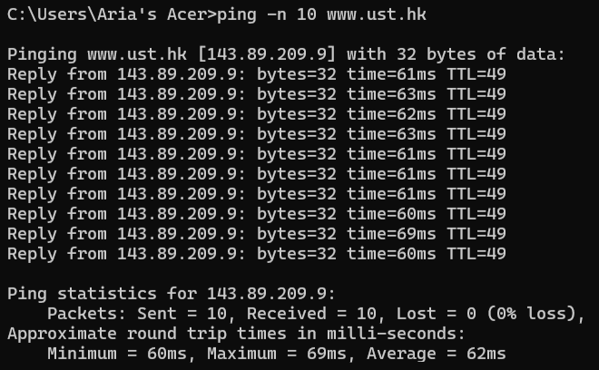
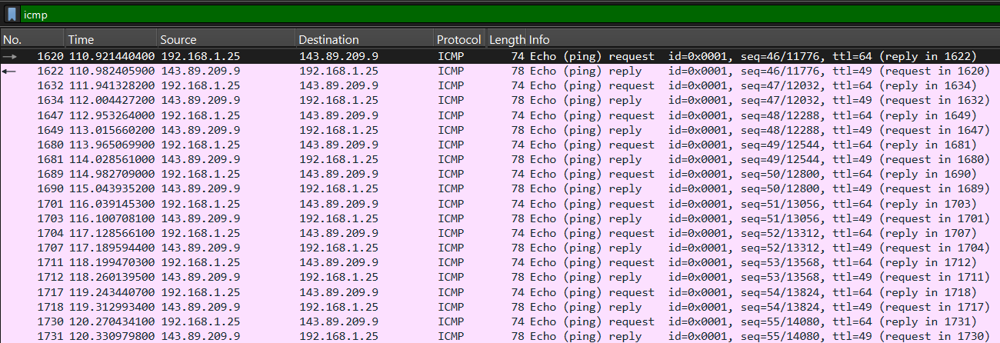
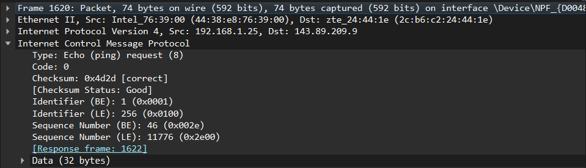
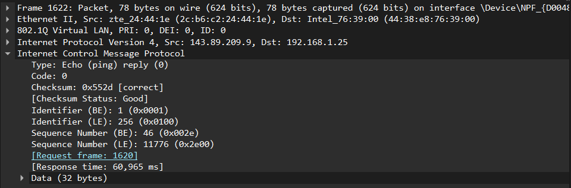

# ICMP

ICMP (Internet Control Message Protocol) merupakan protokol jaringan yang digunakan untuk mengirimkan pesan kontrol, informasi status, serta laporan kesalahan pada komunikasi jaringan berbasis IP. ICMP tidak digunakan untuk mengirim data pengguna, melainkan membantu proses monitoring dan diagnostik jaringan agar komunikasi dapat berjalan dengan baik.

Protokol ICMP sering digunakan pada berbagai utilitas jaringan seperti `ping` dan `traceroute` untuk memeriksa konektivitas serta menganalisis jalur yang dilalui paket data.

## Fungsi ICMP

1. Membantu proses diagnosis jaringan untuk memastikan koneksi berjalan dengan baik.
2. Memeriksa apakah suatu host atau perangkat tujuan dapat dijangkau.
3. Menyampaikan informasi kesalahan yang terjadi selama proses pengiriman data.
4. Mendukung utilitas jaringan seperti ping dan traceroute.

## Hubungan IP dengan ICMP

ICMP bekerja bersama dengan protokol IP dalam proses komunikasi jaringan. Ketika paket IP dikirimkan, pesan ICMP akan ditempatkan pada payload paket IP untuk membawa informasi kontrol maupun pesan kesalahan. Dengan demikian, ICMP tidak menggantikan fungsi IP, melainkan berperan sebagai protokol pendukung untuk membantu proses komunikasi jaringan.

## Struktur Paket ICMP

Paket ICMP terdiri dari beberapa field penting, yaitu:

1. **Type**, digunakan untuk menunjukkan jenis pesan ICMP.
2. **Code**, memberikan informasi tambahan mengenai jenis pesan tersebut.
3. **Checksum**, digunakan untuk memverifikasi integritas paket.
4. **Identifier**, berfungsi sebagai penanda paket ICMP.
5. **Sequence Number**, menunjukkan urutan paket yang dikirim.

## Analisis ICMP yang Dihasilkan oleh Ping

### Langkah-Langkah

1. Buka Wireshark dan pilih interface jaringan yang aktif.
2. Mulai proses capture paket.
3. Buka Command Prompt kemudian jalankan perintah: ping -n 10 www.ust.hk

4. Hentikan proses capture pada Wireshark.
5. Gunakan filter dan cari icmp
6. Pilih salah satu paket ICMP Echo Request.
7. Pilih salah satu paket ICMP Echo Reply.

## Analisis Program

Perintah `ping` digunakan untuk menguji konektivitas antara komputer dengan host tujuan. Pada percobaan ini digunakan opsi `-n 10` yang berarti sistem akan mengirimkan sepuluh kali permintaan ping ke server tujuan.

Setiap proses ping menghasilkan satu paket **ICMP Echo Request** dan satu paket **ICMP Echo Reply**. Oleh karena itu, total paket ICMP yang ditampilkan pada Wireshark adalah sebanyak 20 paket yang terdiri dari 10 Echo Request dan 10 Echo Reply.

## Hasil Percobaan

### Pesan ICMP yang Dihasilkan oleh Ping

Hasil capture menunjukkan bahwa program ping menghasilkan dua jenis pesan ICMP, yaitu **ICMP Echo Request** dan **ICMP Echo Reply**. Kedua paket tersebut digunakan untuk mengukur keterjangkauan host tujuan serta waktu respons jaringan.

### ICMP Echo Request

Berdasarkan hasil pengamatan, paket Echo Request memiliki informasi sebagai berikut:

* **Type = 8**, menunjukkan bahwa paket merupakan Echo Request.
* **Code = 0**, menandakan tidak terdapat informasi tambahan atau error.
* **Checksum = 0x4d2d [correct]**, menunjukkan paket diterima dengan baik.
* **Identifier = 1 (0x0001)**, digunakan sebagai identitas paket.
* **Sequence Number = 46 (0x002e)**, menunjukkan urutan paket yang dikirim.

### ICMP Echo Reply

Berdasarkan hasil capture, paket Echo Reply memiliki informasi berikut:

* **Type = 0**, menunjukkan bahwa paket merupakan Echo Reply.
* **Code = 0**, tidak terdapat informasi tambahan maupun error.
* **Checksum = 0x552d [correct]**, menunjukkan integritas paket terjaga.
* **Identifier = 1 (0x0001)**, sama dengan paket request sehingga dapat dicocokkan.
* **Sequence Number = 46 (0x002e)**, menunjukkan balasan untuk paket request yang sama.

Dari hasil tersebut dapat disimpulkan bahwa komunikasi ping berlangsung dengan baik karena seluruh paket request memperoleh balasan dari host tujuan.

## Analisis ICMP yang Dihasilkan oleh Traceroute

### Langkah-Langkah

1. Buka Wireshark dan pilih interface jaringan yang aktif
2. Mulai proses capture paket
3. Buka Command Prompt kemudian jalankan perintah: tracert www.ust.hk

.png)

4. Hentikan proses capture.
5. Gunakan filter dan cari icmp
6. Pilih salah satu paket ICMP Echo Request.
7. Pilih salah satu paket ICMP Time Exceeded (TTL).

## Analisis Program

Perintah `tracert` digunakan untuk mengetahui jalur yang dilewati paket menuju host tujuan. Program ini memanfaatkan mekanisme TTL (Time To Live) yang nilainya akan berkurang setiap kali melewati router.

Ketika nilai TTL habis sebelum mencapai tujuan, router akan mengirimkan pesan **ICMP Time Exceeded** kepada pengirim. Dengan cara tersebut, setiap hop yang dilalui paket dapat diketahui dan ditampilkan oleh traceroute.

## Hasil Percobaan

### Pesan ICMP yang Dihasilkan oleh Traceroute

.png)

Hasil capture menunjukkan bahwa traceroute menghasilkan dua jenis pesan ICMP utama, yaitu:

1. **ICMP Echo Request**, digunakan untuk meminta respons dari host atau router yang dilewati.
2. **ICMP Time Exceeded**, digunakan oleh router untuk memberitahukan bahwa nilai TTL paket telah habis sebelum mencapai tujuan.

### ICMP Echo Request

.png)

Informasi yang diperoleh dari paket Echo Request adalah sebagai berikut:

* **Type = 8**, menunjukkan paket merupakan Echo Request.
* **Code = 0**, tidak terdapat informasi tambahan.
* **Checksum = 0xf7c6 [correct]**, menunjukkan paket valid.
* **Identifier = 1 (0x0001)**, digunakan sebagai identitas paket.
* **Sequence Number = 56 (0x0038)**, menunjukkan urutan paket yang dikirim.

### ICMP Time Exceeded

.png)

Informasi yang diperoleh dari paket Time Exceeded adalah:

* **Type = 11**, menunjukkan pesan ICMP Time Exceeded.
* **Code = 0**, menunjukkan TTL habis selama proses transmisi.
* **Checksum = 0xf4ff [correct]**, menunjukkan paket diterima tanpa error.
* **Source IP = 192.168.1.1**, yaitu router yang mengirimkan pesan TTL Exceeded.
* **Destination IP = 192.168.1.25**, yaitu perangkat yang menjalankan traceroute.

Hasil tersebut menunjukkan bahwa traceroute berhasil mengidentifikasi router yang dilewati paket melalui pesan ICMP Time Exceeded yang dikirimkan oleh setiap hop.

## Kesimpulan

Berdasarkan praktikum yang telah dilakukan, ICMP merupakan protokol penting yang digunakan untuk membantu proses monitoring, diagnosis, dan pelaporan kesalahan dalam jaringan IP. Melalui Wireshark dapat diamati berbagai jenis pesan ICMP yang digunakan dalam utilitas jaringan seperti ping dan traceroute.

Pada percobaan ping ditemukan paket ICMP Echo Request dan Echo Reply yang digunakan untuk menguji konektivitas host. Sementara itu, pada percobaan traceroute ditemukan paket ICMP Echo Request dan Time Exceeded yang digunakan untuk mengetahui jalur perjalanan paket dalam jaringan. Hasil praktikum menunjukkan bahwa ICMP memiliki peran penting dalam proses analisis dan troubleshooting jaringan komputer.