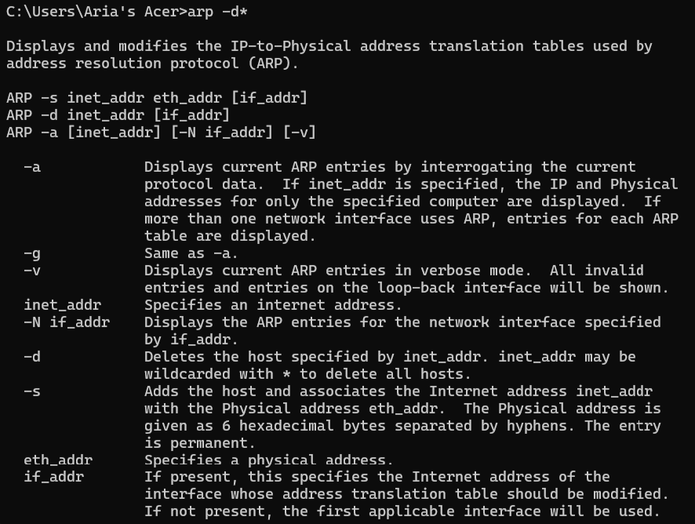
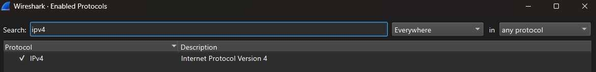
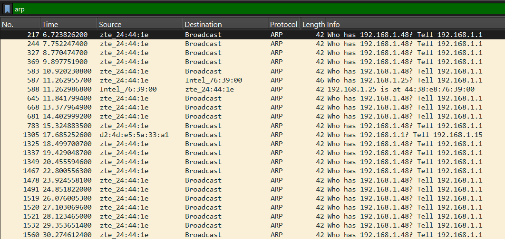
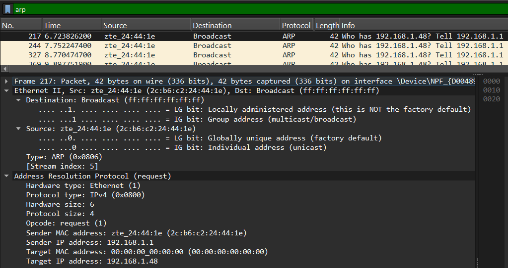

# ARP

ARP (Address Resolution Protocol) merupakan protokol jaringan yang digunakan untuk menerjemahkan alamat IP menjadi alamat MAC Address pada jaringan lokal (LAN). Protokol ini diperlukan karena komunikasi pada lapisan Data Link menggunakan MAC Address sebagai alamat tujuan, sedangkan pengguna umumnya mengenali perangkat melalui alamat IP.

Dengan adanya ARP, perangkat dapat mengetahui alamat fisik dari perangkat tujuan sehingga proses pengiriman data dalam jaringan lokal dapat dilakukan dengan benar.

## Konsep ARP

ARP bekerja pada perbatasan antara Layer 2 (Data Link Layer) dan Layer 3 (Network Layer) dalam model OSI. Fungsi utama ARP adalah menghubungkan alamat logis berupa IP Address dengan alamat fisik berupa MAC Address.

Ketika sebuah perangkat ingin berkomunikasi dengan perangkat lain dalam jaringan lokal, perangkat tersebut harus mengetahui MAC Address tujuan terlebih dahulu. Oleh karena itu, ARP digunakan untuk mencari dan memperoleh informasi MAC Address berdasarkan IP Address yang diketahui.

## Cara Kerja ARP

1. Perangkat ingin mengirimkan data ke alamat IP tertentu dalam jaringan lokal.
2. Sistem memeriksa ARP Cache untuk mengetahui apakah pasangan IP dan MAC Address tujuan sudah tersimpan.
3. Jika informasi belum tersedia, perangkat akan mengirimkan ARP Request secara broadcast.
4. Perangkat yang memiliki IP Address tersebut akan mengirimkan ARP Reply yang berisi MAC Address miliknya.
5. Informasi IP dan MAC Address kemudian disimpan pada ARP Cache.
6. Setelah MAC Address diketahui, proses pengiriman data dapat dilakukan.

## Analisis ARP Menggunakan Wireshark

### Langkah-Langkah

1. Buka Command Prompt sebagai Administrator
2. Jalankan perintah arp -d* untuk menghapus seluruh isi ARP Cache

3. Buka Wireshark kemudian pilih menu Analyze → Enabled Protocols → IPv4

4. Jalankan proses capture pada Wireshark.
5. Buka browser dan akses alamat http://gaia.cs.umass.edu/wireshark-labs/HTTP-ethereal-lab-file3.html
6. Hentikan proses capture setelah halaman berhasil diakses
7. Gunakan filter dan cari arp

8. Pilih salah satu paket ARP untuk dianalisis.

## Analisis Paket

Pada percobaan ini dilakukan pengamatan terhadap paket ARP menggunakan Wireshark. Setelah ARP Cache dihapus, komputer akan kembali melakukan proses ARP ketika membutuhkan alamat MAC dari perangkat tujuan dalam jaringan lokal.

Berdasarkan hasil capture Wireshark, paket yang diamati merupakan **ARP Request** dengan nilai **Opcode = Request (1)**. Paket dikirim oleh perangkat dengan alamat IP **192.168.1.1** dan MAC Address **2c:b6:c2:24:44:1e** untuk mencari alamat MAC dari perangkat yang memiliki IP **192.168.1.48**.

Karena alamat MAC tujuan belum diketahui, nilai **Target MAC Address** masih bernilai **00:00:00:00:00:00**. Oleh karena itu, paket ARP dikirim menggunakan alamat broadcast **ff:ff:ff:ff:ff:ff** sehingga dapat diterima oleh seluruh perangkat yang berada dalam jaringan lokal.

Informasi pada kolom Info menunjukkan pesan:

> "Who has 192.168.1.48? Tell 192.168.1.1"

Pesan tersebut berarti perangkat dengan IP 192.168.1.1 sedang menanyakan perangkat mana yang memiliki alamat IP 192.168.1.48. Jika perangkat tujuan menerima permintaan tersebut, maka perangkat akan mengirimkan ARP Reply yang berisi MAC Address miliknya.

Dari hasil pengamatan dapat disimpulkan bahwa ARP digunakan untuk menerjemahkan alamat IP menjadi alamat MAC sebelum proses pengiriman data dilakukan pada jaringan Ethernet. Tanpa proses ARP, perangkat tidak dapat mengetahui alamat fisik tujuan yang diperlukan untuk mengirim frame pada jaringan lokal.

## Kesimpulan

Berdasarkan hasil capture menunjukkan paket ARP Request yang dikirim secara broadcast dari perangkat dengan IP 192.168.1.1. Paket tersebut digunakan untuk mencari MAC Address milik perangkat dengan IP 192.168.1.48. Karena alamat MAC tujuan belum diketahui, Target MAC Address masih bernilai 00:00:00:00:00:00. Hal ini menunjukkan bahwa proses ARP berhasil diamati dan digunakan untuk melakukan pemetaan alamat IP ke alamat MAC pada jaringan lokal.