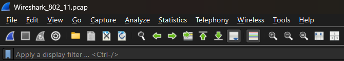
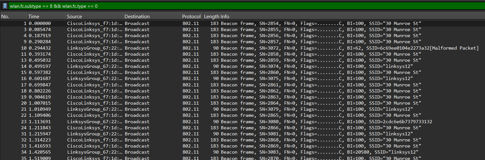
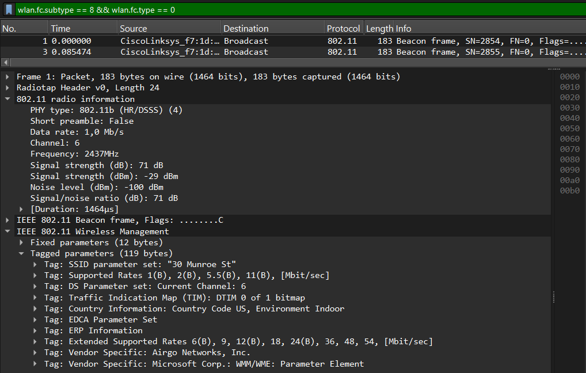
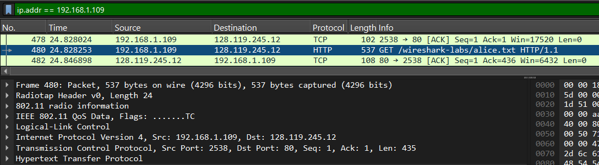
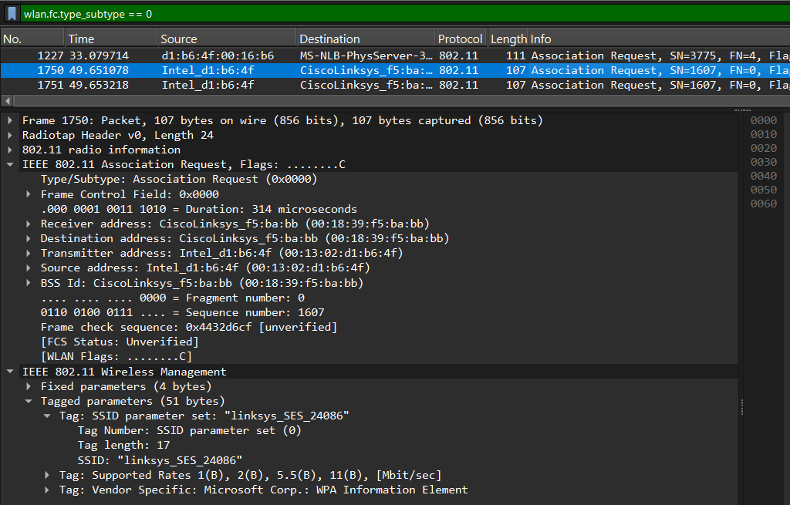
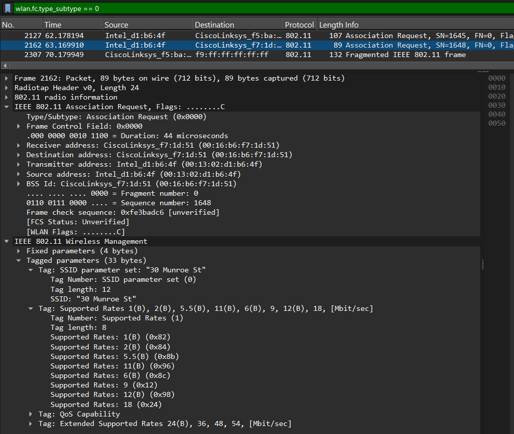
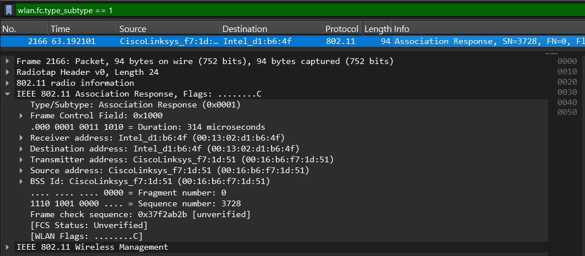

# WIFI

Wi-Fi merupakan teknologi jaringan nirkabel yang memungkinkan perangkat berkomunikasi dan bertukar data tanpa menggunakan media kabel. Teknologi ini dikembangkan berdasarkan standar IEEE 802.11 yang mengatur komunikasi data pada jaringan Wireless Local Area Network (WLAN).

Standar IEEE 802.11 mendefinisikan aturan pada lapisan Physical Layer dan Media Access Control (MAC Layer) sehingga perangkat dapat saling berkomunikasi melalui gelombang radio dengan mekanisme yang terstandarisasi.

## Dasar Teori

### Perbandingan Frekuensi Jaringan Wi-Fi

#### Frekuensi 2.4 GHz

Kelebihan:

* Memiliki jangkauan sinyal yang lebih luas.
* Mampu menembus dinding dan penghalang fisik dengan lebih baik.

Kekurangan:

* Kecepatan transfer data relatif lebih rendah.
* Lebih rentan terhadap interferensi karena banyak perangkat menggunakan frekuensi yang sama.

#### Frekuensi 5 GHz

Kelebihan:

* Kecepatan transfer data lebih tinggi.
* Tingkat interferensi lebih rendah.
* Cocok digunakan untuk kebutuhan bandwidth yang besar.

Kekurangan:

* Jangkauan sinyal lebih pendek.
* Sulit menembus penghalang seperti dinding atau beton.

### Access Point

Access Point (AP) merupakan perangkat yang berfungsi sebagai penghubung antara jaringan nirkabel dan jaringan kabel. Selain menyediakan akses bagi perangkat wireless, Access Point juga bertugas menyebarkan sinyal Wi-Fi sehingga perangkat dapat terhubung ke jaringan tanpa memerlukan kabel secara langsung.

Untuk melakukan analisis pada praktikum ini, digunakan file capture Wireshark yang diperoleh dari:

```text
http://gaia.cs.umass.edu/wireshark-labs/wireshark-traces.zip
```

File yang digunakan adalah **Wireshark_802_11.pcap** dan dibuka menggunakan aplikasi Wireshark.

## Analisis Beacon Frame

Beacon Frame merupakan frame manajemen yang dikirim secara berkala oleh Access Point untuk mengumumkan keberadaan jaringan Wi-Fi kepada perangkat di sekitarnya. Frame ini berisi berbagai informasi penting seperti SSID, channel, kecepatan transfer data yang didukung, dan parameter jaringan lainnya.

### Langkah-Langkah

1. Buka file `Wireshark_802_11.pcap` menggunakan Wireshark



2. Gunakan filter (wlan.fc.subtype == 8 && wlan.fc.type == 0) untuk menampilkan Beacon Frame



4. Pilih salah satu frame untuk dianalisis lebih lanjut



### Berdasarkan ekspansi detail paket pada Frame 1, ditemukan parameter-parameter berikut:

- **PHY Type (802.11b (HR/DSSS))**: Menunjukkan bahwa jaringan menggunakan standar IEEE 802.11b dengan metode modulasi High-Rate Direct Sequence Spread Spectrum (HR/DSSS).
- **Short Preamble (False)**: Menandakan penggunaan Long Preamble untuk menjaga kompatibilitas dengan perangkat yang lebih lama.
- **Data Rate (1.0 Mb/s)**: Menunjukkan kecepatan dasar yang digunakan saat Access Point mengirim Beacon Frame.
- **Channel (6) / Frequency (2437 MHz)**: Jaringan beroperasi pada Channel 6 di frekuensi 2.4 GHz.
- **Signal Strength / Noise Level**: Kekuatan sinyal yang diterima sebesar **-29 dBm** (sangat baik) dengan tingkat gangguan (**Noise**) sebesar **-100 dBm**.
- **Signal-to-Noise Ratio (71 dB)**: Menunjukkan kualitas sinyal yang sangat baik karena selisih antara sinyal dan noise cukup besar.

### Analisis Tagged Parameters

- **Tag: SSID Parameter Set**: Menampilkan nama jaringan Wi-Fi, yaitu **"30 Munroe St"**.
- **Tag: Supported Rates**: Menunjukkan kecepatan transfer data yang didukung Access Point, yaitu **1 Mbps, 2 Mbps, 5.5 Mbps, dan 11 Mbps**.
- **Tag: DS Parameter Set**: Menunjukkan bahwa Access Point menggunakan **Channel 6**.
- **Tag: Extended Supported Rates**: Menampilkan dukungan kecepatan tambahan mulai dari **6 Mbps hingga 54 Mbps**.

## Analisis Data Transfer

Untuk mengamati proses pertukaran data pada jaringan nirkabel digunakan filter berdasarkan alamat IP server.

### Langkah-Langkah

1. Buka file capture pada Wireshark
2. Terapkan filter ip.addr == 192.168.1.109
3. Amati proses komunikasi yang terjadi antara client dan server
4. Identifikasi proses TCP Handshake dan HTTP Request yang muncul



## Analisis Program

Filter tersebut menampilkan seluruh paket yang melibatkan perangkat klien dengan alamat IP 192.168.1.109. Berdasarkan hasil pengamatan pada Frame 480, terlihat paket HTTP GET yang digunakan untuk meminta file /wireshark-labs/alice.txt dari server.

Sebelum proses transfer data dilakukan, terjadi proses TCP Three-Way Handshake yang terdiri dari SYN, SYN-ACK, dan ACK untuk membangun koneksi antara klien dan server. Setelah koneksi berhasil dibuat, klien mengirimkan permintaan HTTP GET kepada server.

Pada paket yang diamati, alamat IP sumber (Source) adalah 192.168.1.109 sebagai klien, sedangkan alamat IP tujuan (Destination) adalah 128.119.245.12 sebagai server. Paket data dikirim menggunakan protokol TCP dengan port tujuan 80, yang merupakan port standar untuk layanan HTTP.

Selain itu, terlihat bahwa data dibungkus menggunakan protokol Logical-Link Control (LLC) sebelum diteruskan ke lapisan IPv4 dan TCP. Hal ini menunjukkan bagaimana data diproses melalui beberapa lapisan protokol sebelum akhirnya dikirimkan melalui jaringan nirkabel.

## Hasil Percobaan

Hasil capture menunjukkan adanya paket HTTP GET dari klien dengan alamat IP 192.168.1.109 menuju server 128.119.245.12. Paket tersebut digunakan untuk meminta file `/wireshark-labs/alice.txt` melalui protokol HTTP. Komunikasi berlangsung menggunakan protokol TCP pada port 80 dan diawali dengan proses Three-Way Handshake sebelum data ditransfer.

## Analisis Proses Association dan Disassociation

Association merupakan proses ketika perangkat klien meminta izin untuk bergabung ke Access Point. Sebaliknya, Disassociation merupakan proses pemutusan koneksi antara klien dan Access Point.

### Langkah-Langkah

1. Gunakan filter (wlan.fc.type_subtype == 0) untuk melihat frame Association
2. Amati paket Association Request yang muncul
3. Bandingkan paket awal dan paket akhir
4. Gunakan filter (wlan.fc.type_subtype == 1) untuk melihat Association Response
5. Analisis paket Association Response yang diperoleh.

#### Diterapkan ekspresi filter untuk melihat manajemen jabat tangan nirkabel:wlan.fc.type_subtype == 0
- Expand paket awal



- Expand paket akhir



#### Perbandingan expand paket awal dan akhir
Jika kita membandingkan paket permintaan asosiasi teratas (Frame 1750) dengan paket asosiasi terbawah (Frame 2162), terjadi perubahan pada bagian parameter SSID dan Access Point tujuan. Pada Frame 1750, klien **Intel_d1:b6:4f** mencoba berasosiasi ke Access Point **CiscoLinksys_f5:ba:bb** dengan SSID **"linksys_SES_24086"**. Sedangkan pada Frame 2162, klien yang sama berpindah dan mengirim permintaan asosiasi baru ke Access Point **CiscoLinksys_f7:1d:51** dengan SSID **"30 Munroe St"**. Perubahan ini menunjukkan bahwa perangkat klien melakukan perpindahan koneksi (roaming) dari jaringan **"linksys_SES_24086"** ke jaringan **"30 Munroe St"**.

Tanggapan asosiasi (Association Response) dianalisis menggunakan filter **wlan.fc.type_subtype == 1**. Berdasarkan hasil pengamatan ditemukan **Frame 2166** yang merupakan paket Association Response. Pada paket tersebut, Access Point **CiscoLinksys_f7:1d:51** mengirimkan respons kepada klien **Intel_d1:b6:4f** sebagai tanda bahwa permintaan asosiasi telah diterima dan disetujui. Hal ini menunjukkan bahwa klien berhasil terhubung ke jaringan Wi-Fi **"30 Munroe St"**.

#### Tanggapan Asosiasi (Association Response) dianalisis melalui filter subtype respon



wlan.fc.type_subtype == 1

Berdasarkan hasil pengamatan ditemukan Frame 2166 yang merupakan paket Association Response. Pada paket tersebut, Access Point dengan MAC Address **CiscoLinksys_f7:1d:51** mengirimkan respons kepada klien **Intel_d1:b6:4f**. Hal ini dapat dilihat dari nilai **Transmitter Address** dan **Source Address** yang menunjukkan MAC Address milik Access Point, sedangkan **Receiver Address** dan **Destination Address** menunjukkan MAC Address milik klien.

Paket Association Response ini menandakan bahwa Access Point menerima dan menyetujui permintaan asosiasi yang sebelumnya dikirim oleh klien pada Frame 2162. Dengan diterimanya respons tersebut, proses asosiasi berhasil dilakukan sehingga perangkat klien dapat terhubung dan mulai berkomunikasi melalui jaringan Wi-Fi **"30 Munroe St"**.