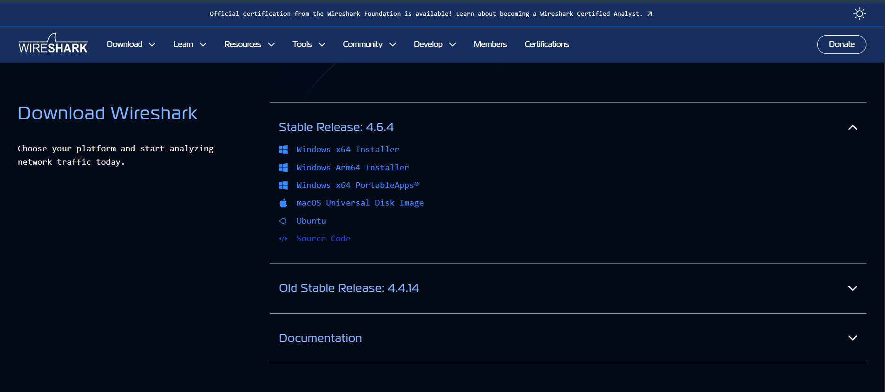
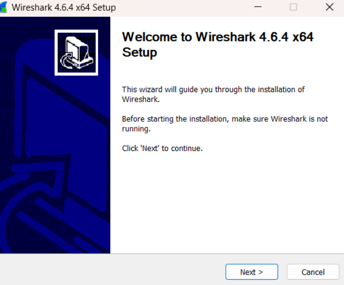
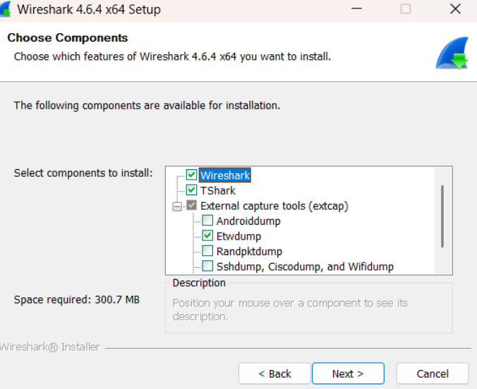
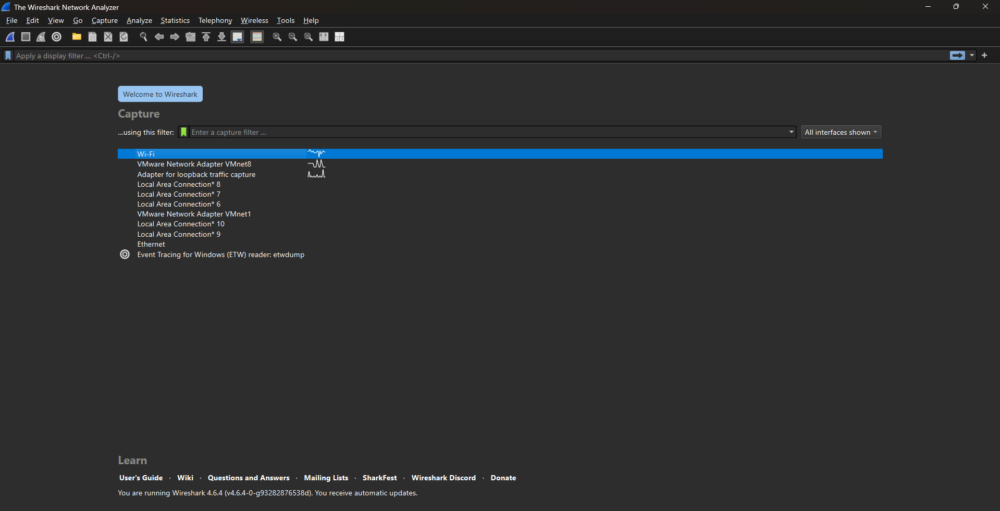

# Laporan Praktikum Week 1 Instalasi Wireshark

## Nama
Aria Restu Pambudi - 103072400168

## Tujuan
Memahami konsep dasar jaringan komputer dan Instalasi Wireshark.

## Penjelasan
Wireshark adalah perangkat lunak yang digunakan untuk menganalisis lalu lintas jaringan (network traffic). Aplikasi ini mampu menangkap, memantau, dan menampilkan paket data yang melintas pada jaringan secara rinci, sehingga pengguna dapat melihat bagaimana data dikirim dan diterima antar perangkat di dalam jaringan.

Kegunaan Wireshark antara lain:

1) Analisis jaringan
Membantu memantau dan memahami aliran data yang terjadi di jaringan, termasuk paket data yang dikirim maupun diterima oleh perangkat.

2) Troubleshooting jaringan
Digunakan untuk mencari dan mendiagnosis masalah pada jaringan, seperti koneksi yang lambat, paket yang hilang, atau kesalahan komunikasi antar perangkat.

3) Keamanan jaringan
Membantu mendeteksi aktivitas jaringan yang tidak wajar atau mencurigakan yang berpotensi menjadi ancaman keamanan.

4) Pembelajaran jaringan
Digunakan sebagai alat belajar untuk memahami cara kerja berbagai protokol jaringan seperti TCP, HTTP, DNS, dan protokol lainnya.

# Cara Instalasi Wireshark

1. Download wireshark melalui browser, pilih yang windows x64 installer (kalo pakai windows)

2. Setelah proses download selesai lanjut ke instalasi dengan doble klik pada wireshark yang telah didownload

3. Klik next-next sampai instalasi dilakukan lalu klik finish/selesai

4. Berikut tampilan setelah proses instalasi dilakukan dan masuk ke aplikasi wireshark
