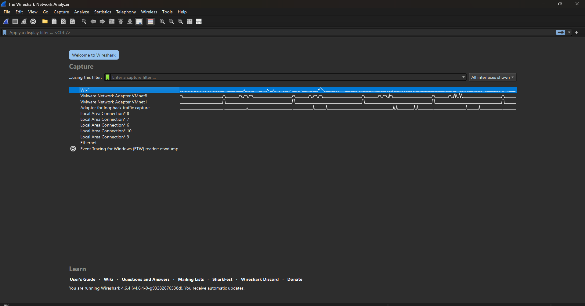
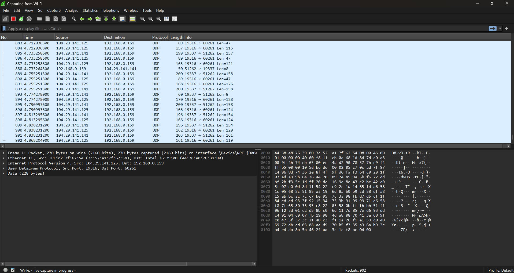
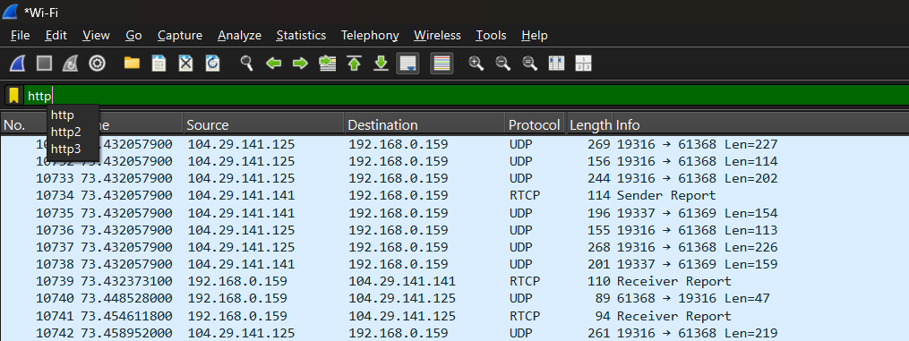
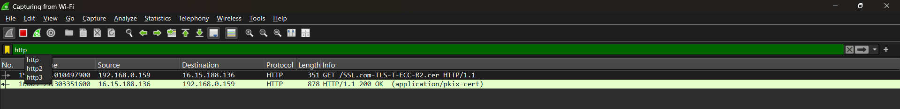
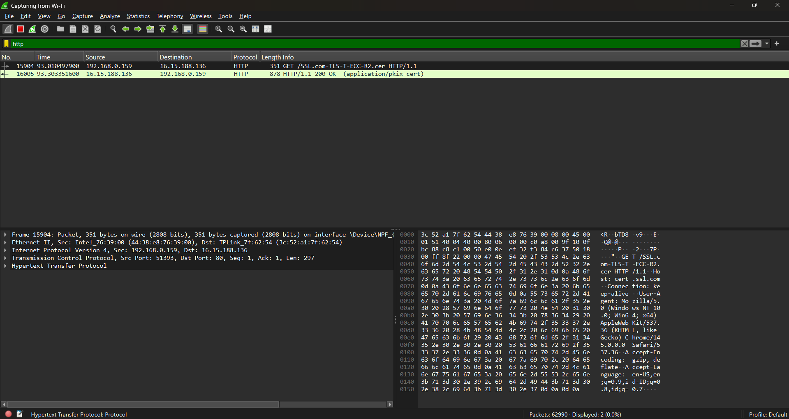

# Laporan Praktikum Week 1 Penggunaan Wireshark (HTTP)

## Nama
Aria Restu Pambudi - 103072400168

## Tujuan
Memahami konsep dasar jaringan komputer dan Contoh Penggunaan Wireshark (HTTP).

# Menggunakan aplikasi Wireshark (HTTP)

Pada modul ini mempelajari bagaimana cara mencari atau memfilter suatu protokol pada wireshark. Sebagain contoh, di sini ingin mencari protokol "HTTP" pada wireshark

1. Pertama buka browser dan mengakses alamat web yang berbasis HTTP (Contoh : https://imada.sdu.dk/~jamik/dm557-19/wireshark/wireshark-http.html)

2. Setelah itu buka Wireshark, pada tampilan awal pilih wifi (jika menggunakan wifi namun jika menggunakan LAN bisa pilih ethernet)

3. Berikut tampilan setelah memilih opsi wifi

4. Pada tampilan tersebut di bagian atas ada kolom yang bisa di gunakan untuk filter suatu protokol yang berguna untuk mempermudah mencari protokol yang ingin di cari, misal kita cari pada kolom tersebut "HTTP"

5. Berikut tampilan setelah melakukan filter pencarian "HTTP"

6. Tampilan setelah mencari protokol "HTTP"

# Penjelasan 

Status 200 OK menunjukkan bahwa permintaan (request) yang dikirim oleh komputer klien telah berhasil diterima dan diproses oleh server. Pada gambar terlihat komputer dengan IP 192.168.0.159 mengirim HTTP GET request untuk mengambil file /SSL.com-TLS-T-ECC-R2.cer dari server 16.15.188.136 melalui HTTP/1.1.

Pada bagian Packet Details terlihat susunan protokol yang digunakan dalam proses komunikasi, yaitu Ethernet II, IPv4, TCP, dan HTTP. Hal ini menunjukkan bahwa data yang dikirim melalui jaringan melewati beberapa lapisan protokol sebelum sampai ke tujuan. Proses ini menggambarkan bagaimana permintaan dari klien dikirim ke server dan kemudian server memberikan respons berupa data yang diminta.