# DNS
DNS (Domain Name System) adalah sistem yang berfungsi mengubah nama domain atau host menjadi alamat IP. DNS cukup berperan mengirimkan permintaan ke server DNS lokal dan menerima hasilnya. Proses yang lebih kompleks sebenarnya terjadi di sisi server, di mana server DNS yang tersusun secara hierarkis saling berkomunikasi untuk menyelesaikan permintaan tersebut, baik secara rekursif maupun iteratif, tanpa terlihat oleh klien.

## 1. Nslookup
Nslookup merupakan perintah yang digunakan untuk melakukan query ke server DNS guna memperoleh berbagai informasi terkait domain atau host, seperti alamat IP, nama domain, serta record DNS lainnya. Perintah ini bekerja dengan mengirimkan permintaan ke server DNS tertentu, kemudian menampilkan hasil respons yang diterima kepada pengguna.

### Berikut penggunaan nslookup pada command prompt:
1) Perintah nslookup www.nit.edu digunakan untuk melakukan pencarian informasi DNS terhadap domain tersebut dengan tujuan mengetahui apakah domain tersebut terdaftar dan memiliki alamat IP. Perintah ini bekerja dengan mengirimkan permintaan ke server DNS yang digunakan, kemudian menampilkan hasil respons yang diterima. Pada hasil yang ditunjukkan, domain tidak ditemukan, yang menandakan bahwa domain tersebut tidak tersedia atau tidak terdaftar dalam sistem DNS.
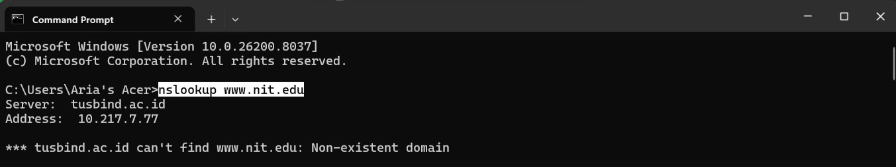

2) Perintah nslookup -type=NS mit.edu digunakan untuk memperoleh informasi mengenai Name Server (NS) yang bertanggung jawab atas domain mit.edu. Perintah ini mengirimkan permintaan ke server DNS untuk mengetahui server mana saja yang mengelola dan melayani resolusi nama domain tersebut.
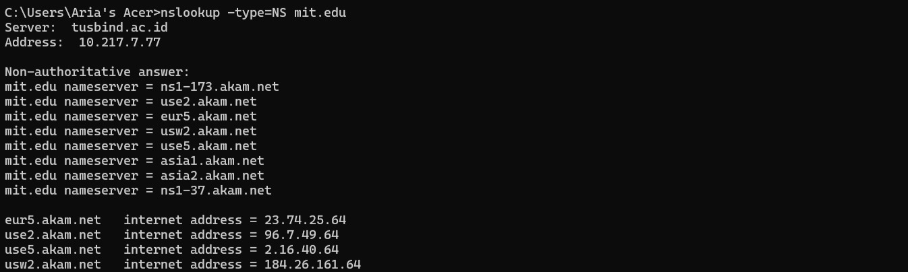

3) Perintah nslookup www.aiit.or.kr bitsy.mit.edu digunakan untuk melakukan pencarian informasi DNS terhadap domain www.aiit.or.kr dengan menggunakan server DNS tertentu, yaitu bitsy.mit.edu, sebagai tujuan query.
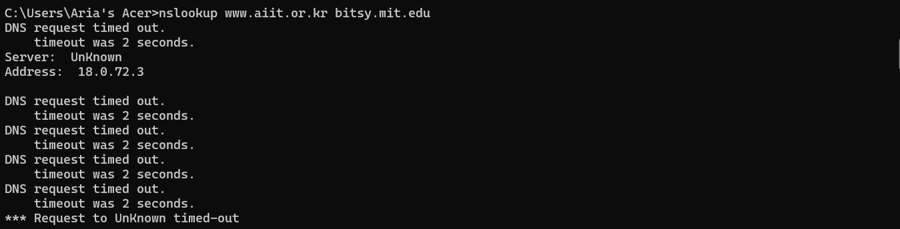

## 2. Ipconfig
Ipconfig berguna untuk mengelola informasi DNS yang tersimpan dalam host. Yang mana host dapat menyimpan catatan DNS yang baru saja diperolehnya. Untuk melihat record yang telah disimpan, setelah prompt C:\> masukkan  perintah berikut:

1) Perintah "ipconfig /all" digunakan untuk menampilkan informasi lengkap konfigurasi jaringan pada komputer. Perintah ini memberikan detail seperti nama host, status koneksi jaringan, alamat IP, subnet mask, gateway, DNS server, serta informasi lain yang berkaitan dengan adaptor jaringan yang digunakan.
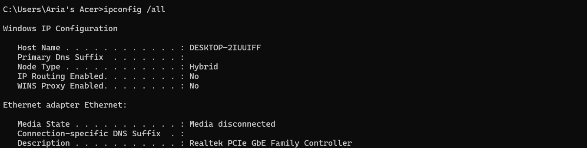

2) Perintah "ipconfig /all > networkinfo.txt" digunakan untuk menampilkan seluruh informasi konfigurasi jaringan, kemudian menyimpannya ke dalam file bernama networkinfo.txt. Hal ini berguna untuk dokumentasi atau analisis lebih lanjut tanpa harus melihat langsung di Command Prompt. Sedangkan perintah ipconfig /flushdns berfungsi untuk menghapus cache DNS yang tersimpan di komputer. Cache ini biasanya berisi hasil pencarian DNS sebelumnya, dan dengan menghapusnya, sistem akan meminta ulang informasi DNS terbaru dari server. Perintah ini sering digunakan untuk mengatasi masalah koneksi atau kesalahan DNS.
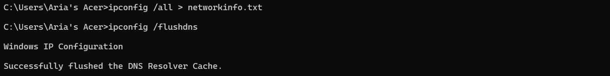

## 3. Tracing DNS dengan Wireshark
### A. Analisis DNS Request dan Response pada Akses Website (www.ietf.org)
Berikut langkah-langkah untuk tracing DNS dengan Wireshark:

1) Buka command prompt (CMD) dan ketikan perintah ipconfig untuk menyalin IP Address "10.217.1.254"
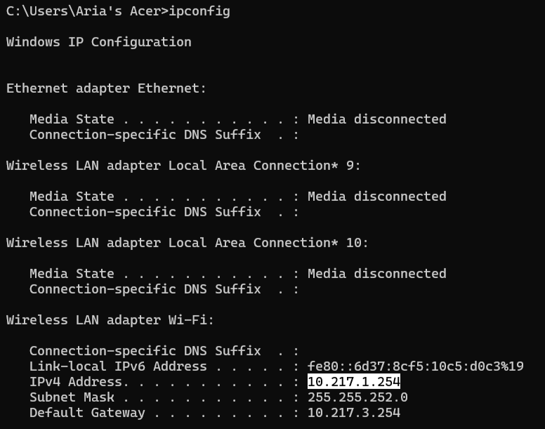

2) Buka aplikasi wireshark kemudian pilih jaringan wifi, karena kita menggunakan wifi. Setelah itu filter IP Address "ip.addr == 10.217.1.254"
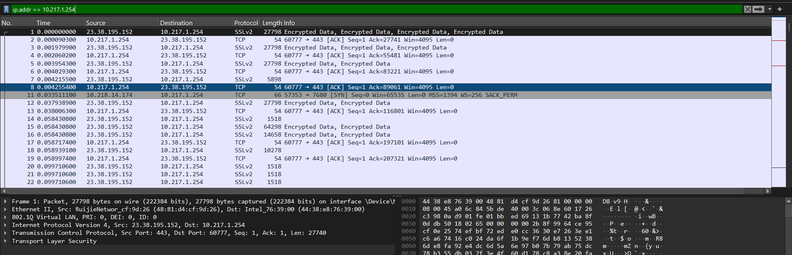

3) Setelah berhasil filter IP Address kemudian buka browser dan masuk ke web "http://www.ietf.org/"

4) Kemudian langkah selanjutnya adalan menambahkan filter di IP Address tadi dengan web yang telah dibuka di browser (ip.addr == 10.217.1.254 && dns.qry.name.contains "ietf")
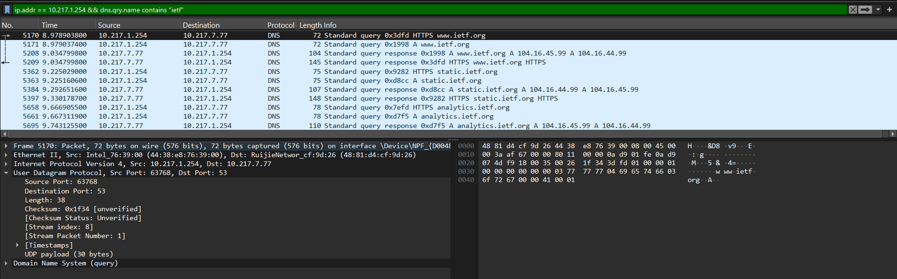

#### Menjawab Pertanyaan

1. Apakah DNS menggunakan UDP atau TCP?
    Jawab: Dns menggunakan UDP
    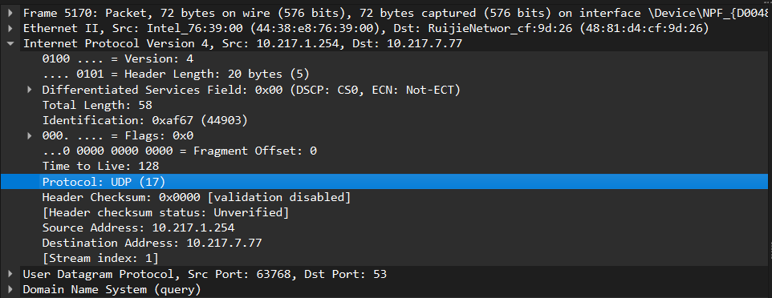

2. Port tujuan pada DNS request & port sumber pada DNS response
    Jawab: 
    - DNS REQUEST -> Source Port (client): 63768 & Destination Port (server): 53
    - DNS RESPONSE -> Source Port (server): 53 & Destination Port (client): 63768
    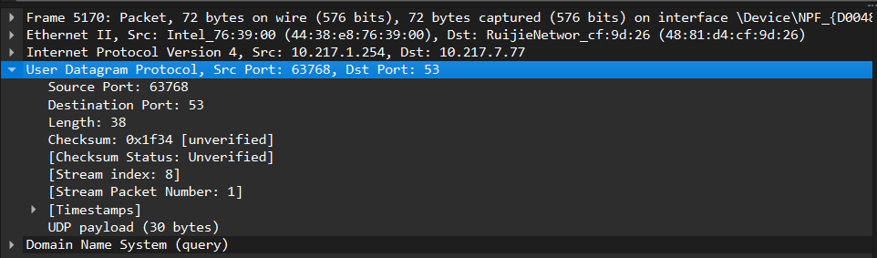

### B. Analisis DNS Menggunakan Perintah nslookup (www.mit.edu)
Berikut langkah-langkah untuk tracing DNS dengan Wireshark:

1) Buka command prompt (CMD) dan ketikan nslookup www.mit.edu

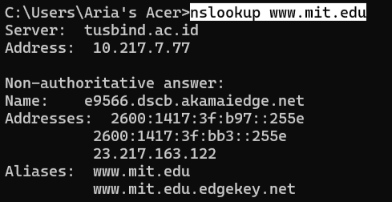

2) Buka aplikasi wireshark kemudian pilih jaringan wifi, karena kita menggunakan wifi. Setelah itu filter DNS, lalu ambil data dari Standard query (request) dan Standard query response dari www.mit.edu
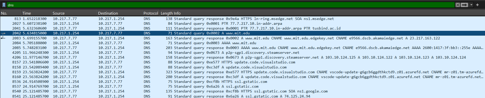

#### Menjawab Pertanyaan

1. Port tujuan request dan port sumber dari response
    Jawab:
    - DNS REQUEST -> Destination Port : 53
    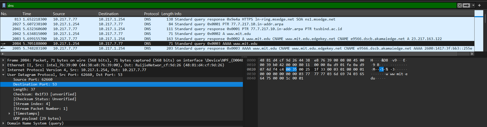
    - DNS RESPONSE -> Source Port : 53
    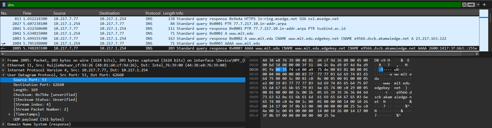

2. Alamat IP request
    Jawab: Request DNS dikirim ke alamat IP 10.217.7.77, alamat tersebut merupakan alamat lokal (IPv6) yang digunakan sebagai DNS server dalam jaringan
    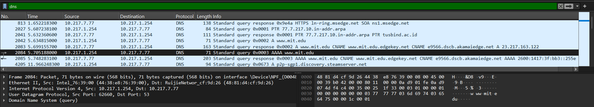

3. Type dan answers request
    Jawab: Tipe DNS request adalah A (Address Record). Pesan ini tidak mengandung jawaban karena hanya berupa permintaan
    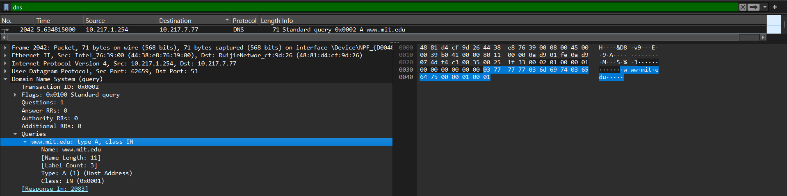

4. Answers response
    Jawab: Terdapat 3 jawaban
    - Jawaban pertama menunjukkan bahwa domain www.mit.edu merupakan alias (CNAME) ke www.mit.edu.edgekey.net, yang berarti domain utama diarahkan ke domain lain.
    - Jawaban kedua menunjukkan alias lanjutan, yaitu www.mit.edu.edgekey.net kembali diarahkan (CNAME) ke e9566.dscb.akamaiedge.net.
    - Jawaban ketiga merupakan hasil akhir berupa A record, yaitu alamat IP 23.217.163.122, yang menjadi tujuan sebenarnya dari proses resolusi domain tersebut.
    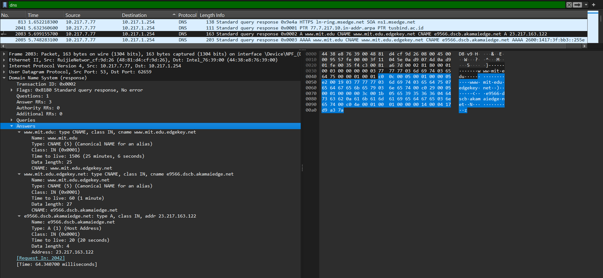

### C. Analisis DNS Record NS Menggunakan nslookup (mit.edu)

### D. Analisis DNS Menggunakan Server Tertentu (www.aiit.or.kr bitsy.mit.edu)